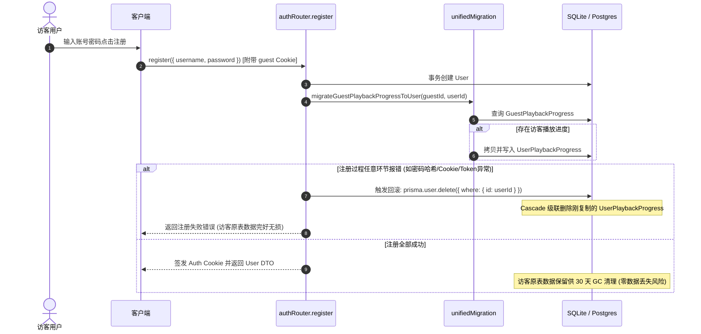
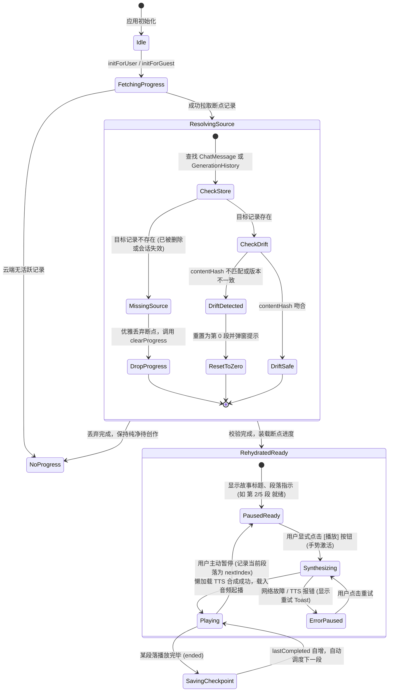

# 技术方案与实施计划：阶段二 段落级断点续播 (Phase 2 Paragraph-Boundary Resume)

> **文档类型**：实施方案与架构规范 (Implementation Plan & Architectural Specification)
> **创建日期**：2026-09-05
> **基线版本**：commit `1c495a81ac5cf35b8a11f3c78fccbb5d55002d9b` (`main`)
> **分支**：`docs/phase2-paragraph-resume`
> **作者**：DOCUMENTATION-ONLY Planning Worker
> **修订记录**：2026-09-05 审阅变更修复（闭环解决 7 项阻断性审查意见：稳定创作源标识、确定性分段与文本漂移检测、Prisma 模型 User 反向关系、服务端单调并发谓词与显式重播、自适应预加载窗口与成本限额、播放器双层 UI 模型与段内 Seek 契约、真实路由路径与全量测试用例完善）
> **前序方案**：[Phase 1 Creative-Record Cloud Sync](../specs/2026-09-05-creative-record-cloud-sync.md)
> **实施范围授权**：仅规划与设计文档，本阶段严禁修改业务代码、数据库模式、迁移脚本或生产环境。

---

## 目录

1. [背景与核心裁决 (Context & Architectural Decisions)](#一背景与核心裁决)
2. [产品契约与非目标 (Product Contract & Non-Goals)](#二产品契约与非目标)
3. [源码现状与证据链 (Source Evidence & Citations)](#三源码现状与证据链)
4. [两套范围方案权衡 (Two Scope Choices)](#四两套范围方案权衡)
5. [数据架构与 API 设计 (Data & API Design)](#五数据架构与-api-设计)
6. [端云职责划分 (Device-Local vs Cloud State)](#六端云职责划分)
7. [访客注册迁移与回滚契约 (Registration Migration & Rollback)](#七访客注册迁移与回滚契约)
8. [登出、水合与多端并发冲突 (Logout, Hydration & Multi-Device Semantics)](#八登出水合与多端并发冲突)
9. [文本分段、自适应预加载、播放器模型与音频重合成 (Segmentation, Prefetch, UI Model & Regeneration)](#九文本分段自适应预加载播放器模型与音频重合成)
10. [30 天生命周期 GC 与容量限额 (Retention, GC & Quotas)](#十30-天生命周期-gc-与容量限额)
11. [安全鉴权、限流防御与成本模型 (Security, Rate Limits & Cost Model)](#十一安全鉴权限流防御与成本模型)
12. [回滚策略与向后兼容 (Rollback Strategy & Backward Compatibility)](#十二回滚策略与向后兼容)
13. [验收测试与 E2E 模拟矩阵 (Acceptance & E2E Matrix)](#十三验收测试与-e2e-模拟矩阵)
14. [实施任务路径清单 (Implementation Task Breakdown)](#十四实施任务路径清单)

---

## 一、背景与核心裁决

### 1.1 阶段一基石回顾
在阶段一（Phase 1: Creative-Record Cloud Sync）中，系统已实现：
- 具名访客 `g_<uuid>` 与登录用户的全量创作记录云端化（单会话聊天、故事卡片、作品生成历史、提示词历史）；
- 确立了 **ADR-3：严格坚守“正文与参数持久化，音频按需即时重合成”（No Audio Blob Persistence）** 架构红线，数据库绝不持久化任何音频二进制或临时 Blob URL；
- 确立了 **ADR-1：独立访客表物理隔离** 与 **ADR-5：仅注册时原子迁移、登录绝不覆盖** 的数据安全边界。

### 1.2 阶段二核心裁决：段落边界续播 (Paragraph-Boundary Resume)
在早期的阶段二探索中，曾探讨过记录秒级时间戳（如 `currentTime: 42.5s`）并在刷新后跳转恢复的设想。**用户最新产品决策明确否决该设想，并确立段落边界续播模型**：

1. **绝对禁止秒级/时间偏移续播（Strictly Prohibit Second-Level/Time-Offset Resume）**：
   - 依赖 OpenAI TTS 动态即时重合成的音频，每次生成的音轨时长、字间停顿、韵律语速、分块编码均存在微小浮动；
   - 旧的 `currentTime` 无法稳定映射到新合成的音频时间线上；
   - 强行 seek 进入刚开始流式加载的新音频容易导致网络缓冲卡死、爆音或从词句中间劈裂播放，体验极度劣化；
   - 音频 Blob URL 本身为浏览器内存瞬态资源（`blob:http://...`），硬刷新后立即失效，不可复用。
2. **段落边界续播模型（Paragraph-Boundary Resume Model）**：
   - 持久化**稳定创作源定位器（Creative Source Locator）**：当前主体（用户/访客）、源类型（聊天会话故事卡片 / 作品库历史条目）、溯源业务标识（`messageId` / `generationId`）；
   - 持久化**段落边界进度（Paragraph Indices）**：记录**上一完整听完的段落序号（`lastCompletedParagraphIndex`）**与**下一次应当播放的目标段落序号（`nextParagraphIndex`）**；
   - 持久化**文本指纹与算法版本（Text Fingerprint & Versioning）**：基于规范化正文计算的 `contentHash` 与分段算法版本号 `segmentationVersion`，用于水合期侦测正文变动或漂移；
   - 持久化**重合成上下文（Generation Context）**：音色 `voiceId`、语速 `speed`、允许播放倒计时 `remainingAllowedMs` 与单次播放标记 `isOneShot`；
   - 重新加载或切换设备时，前端水合定位器并重新请求 TTS，从**下一个完整段落（Next Whole Paragraph）**开始合成与播放。
3. **明示产品权衡（Explicit Midway Tradeoff）**：
   - **若用户在某一段落播放中途暂停或退出，下一次续播将从该段落的开头完整重播**；
   - 系统绝不在段落中途截断音频或强行跳转。用户对“从当前小段开头重新听”的认知负荷和心理接受度，显著高于“截断单词破音”或“跳过未听完内容”。
4. **停驻就绪态契约（Land PAUSED/READY Contract）**：
   - 页面刷新或设备切换恢复后，播放器必须停驻在 **PAUSED（已暂停）/ READY（已就绪）** 状态；
   - **绝对严禁自动强行起播（Never Force Autoplay）**；
   - 必须由用户显式点击“播放 / 继续收听”按钮后，才触发手势解锁与音频回放，同时完全符合主流浏览器（Chrome, Safari, iOS WebKit）严格的 Audio Autoplay Policy。
5. **稳定创作源标识与落盘门禁（Stable Source Identity & Checkpoint Guard）**：
   - 断点持久化的 `sourceId` 必须严格引用真实的已持久化数据标识：`chat` 场景下必须是数据库已持久化的 `ChatMessage.messageId`；`generation` 场景下必须是 `GenerationHistory.id`；
   - **严禁持久化 `replay-text-${Date.now()}` 等瞬态临时 ID**，避免刷新水合后在消息列表搜寻失败产生悬挂锚点；
   - 断点记录仅允许在 `status === 'delivered'` 的有效聊天故事卡片或已保存的作品库条目上发生；
   - 严禁在 `preloadStore` 异步拉取中生成的 `status === 'sending'` 占位消息上记录检查点；
   - 当水合解析发现目标关联源在服务端已被删除或丢失时，前端执行**优雅丢弃（Drop Progress）**，清空本地断点并异步清除无主记录，播放器保持纯净空闲待创作态，绝不残留悬挂锚点。
6. **确定性文本分段与漂移重置（Deterministic Segmentation & Drift Reset）**：
   - 换行统一规整为 `\n`（抹平 CRLF/CR 平台差异），剔除空白段；
   - 针对单段无换行超长故事（> 350 字），依标点符号（`。！？!?`）实施确定性二级切分；针对密集短对话（< 80 字），采用确定性贪心前向合并，杜绝短音频碎片；
   - 水合时以规范化文本（Normalized Text，非原始裸字节）重新计算短哈希 `contentHash`；若哈希或分段版本不匹配，判定发生“文本漂移”，安全重置进度为第 0 段从头播放。
7. **服务端单调并发仲裁与显式重播（Monotonic Concurrency & Explicit Force Reset）**：
   - 同一故事的断点推进在服务端受到单调递增约束，旧标签页或乱序请求中的回退进度（`nextParagraphIndex < currentDBIndex`）被服务端静默过滤；
   - 针对用户显式发起的“从头重播”，客户端提交带有 `forceReset: true` 意图的载荷，服务端合法放行重置为第 0 段。
8. **自适应预加载与成本严控（Adaptive Prefetch Window & Cost Controls）**：
   - 废除原有 `AudioControllerHost` 中硬编码的 `remaining <= 120` 秒误触逻辑，改为自适应剩余时长窗口 `Math.min(10, Math.max(5, duration * 0.25))`；
   - 严禁超出自适应窗口向后超额预加载（严格限制 `lookahead = 1`），且处于暂停态、离线态或倒计时耗尽时严禁调用 TTS 合成。
9. **播放器双层 UI 模型（Dual-Tier Player UI Model）**：
   - 宏观层面指示整体故事篇幅（如 `第 2 / 5 段`）；微观进度条与时间（如 `0:14 / 0:38`）精确对应当前正在播放的自然段音频；
   - 允许用户在当前自然段音频内拖动 Seek，但刷新后仍遵循段落边界重播契约（段内偏移永不上云）；
   - 段落切换利用预载 Blob URL 实施平滑接力，消除 `0:00` 闪烁骨架；水合态通过 `isRehydratedReady` 解除原有 `duration > 0` 对播放按钮的禁用死锁。

---

## 二、产品契约与非目标

### 2.1 产品契约 (Product Contract)
1. **跨页面与刷新恢复**：用户或访客在收听故事中途硬刷新页面或关闭重开标签页，进入 `/player` 或 `/chat` 时，播放器不再表现为 `0:00 / 待创作`，而是展示上次故事的曲目名称、当前段落指示（如“第 3 / 8 段 就绪”），并处于就绪暂停态。
2. **跨设备进度同步（登录用户）**：登录用户在手机端听完故事第 2 段，暂停并切换至桌面端登录，桌面端读取云端进度并在点击播放后从第 3 段起播。
3. **具名访客设备内延续**：具名访客凭借加密 HttpOnly Cookie 中的 `guestId`，在同一浏览器内刷新、重开会话后，能精准延续访客期间的段落收听进度。
4. **倒计时状态延续**：若用户设置了播放定时器（如 30 分钟睡眠陪伴），断点续播时同步继承剩余有效时长，倒计时不会因为硬刷新而被重置为初始时长。
5. **段内临时 Seek 与段落重播边界契约**：在当前段落处于播放状态时，允许用户在当前段落已缓冲的时长范围内自由 seek；但一旦用户主动暂停并关闭标签页、或者刷新页面，断点只保留段落序号，下一次恢复收听坚决从该段落的第 0 秒完整重播。
6. **源缺失与文本漂移安全兜底**：若云端记录指向的故事已被删除，静默重置为空闲态；若故事正文被修改导致文本哈希不一致，自动降级为从第 0 段重新播放，系统永不崩溃、无悬挂残留。

### 2.2 明确非目标 (Non-Goals)
1. **非目标 1：秒级/帧级精确定位恢复**——不记录、不持久化 `currentTime`，不尝试 `audio.currentTime = offset`。
2. **非目标 2：音频文件/二进制持久化**——数据库、对象存储或服务器文件系统绝不保存 MP3 或 Blob 数据。
3. **非目标 3：无手势静默自动起播**——页面加载完成后绝不触发 `audio.play()`，规避浏览器安全阻断并保障收听预期。
4. **非目标 4：完全离线音频缓存（PWA Offline Audio）**——由于不存音频文件，无网络连接时无法合成新音频（离线时提供友好降级与重试引导）。
5. **非目标 5：多端毫秒级实时联播镜像（Live Mirroring）**——不构建多端 WebSocket 实时同步联播，仅同步离散段落检查点。
6. **非目标 6：深远投机性音频预加载（Speculative Multi-Segment TTS）**——严格禁止在当前段落未播放至末尾时预先合成后续第 2 段及以上内容，严禁在暂停态下空耗 TTS 算力与网络带宽。

---

## 三、源码现状与证据链

对 `audio-player-next` 现有工程代码进行静态审视，获取以下关键事实与调用链依据：

### 3.1 播放器状态纯内存化现状
- **证据 1**：`stores/playbackStore.ts:14-42`
  定义了 `PlaybackStoreBaseState`，包含 `sessionId`, `isPlaying`, `currentSegmentIndex`, `currentTime`, `duration`, `currentAudioUrl`, `currentMessageId` 等状态。全部存储于 Zustand 内存，未挂载任何持久化中间件。
- **证据 2**：`stores/playbackStore.ts:87-103`
  `INITIAL_STATE` 在每次页面刷新时无差别将所有状态重置为 `currentTime: 0, duration: 0, currentAudioUrl: null, currentMessageId: null`。
- **证据 3**：`app/(main)/player/components/AudioPlayer/index.tsx:54, 80-82`
  定义了 `const hasAudio = duration > 0;`。页面硬刷新后，因 `duration` 为 0，`hasAudio` 为 `false`，导致唱片停止、播放按钮被禁用（`disabled={!hasAudio}`），产生“刷新后无法恢复播放”的死锁。
- **证据 4**：`components/FloatingPlayer/index.tsx:165-166`
  `const hasTrack = currentAudioUrl !== null; const shouldShowFloatingPanel = isFloatingPlayerEnabled && isVisible && hasTrack;`
  硬刷新后因 `currentAudioUrl` 为 `null`，浮动胶囊直接隐藏或退化为“待创作”。

### 3.2 音频生命周期与无持久化契约
- **证据 5**：`lib/client/ttsGenerate.ts:20-28`
  ```typescript
  const blob = new Blob([bytes], { type: result.contentType });
  return URL.createObjectURL(blob);
  ```
  音频 URL 均由 `URL.createObjectURL` 在当前浏览器内存中临时生成，标签页卸载即被浏览器引擎注销。
- **证据 6**：`stores/chatStore.ts:166-183`
  `toSnapshot` 方法在构造持久化快照时，显式将所有 `storyCard.audioUrl` 覆盖置空为 `''`（第 173 行），坚决不存入数据库。
- **证据 7**：`docs/specs/2026-06-22-player-mirror-playback-investigation.md:27`
  历史调查记录明确确认：“`playbackStore` 为内存态、未持久化；在 `/player` 执行硬刷新会丢失播放态（且 blob 音频地址失效无法恢复），表现为 0:00。属内存态固有行为”。

### 3.3 音频宿主事件与段落推进行为
- **证据 8**：`components/AudioControllerHost/index.tsx:165-174`
  `handlePlay` 启动新音频时，强制将 `audioEl.currentTime = 0`，重置进度。
- **证据 9**：`components/AudioControllerHost/index.tsx:318-335`
  `<audio>` 触发 `ended` 事件时，调用 `handleSegmentEnded()`，随后直接调度 `handlePlay(nextSegment.audioUrl, nextSegment.messageId)` 顺序推进下一段。
- **证据 10**：`app/services/storyFlow.ts:189-209`
  `handleSegmentEnded` 优先通过 `chatStore.selectors.nextStorySegment(currentMessageId)` 查找已生成的下一段，否则调用 `preloadStore.requestPreload()` 自动以“请继续故事”触发下一章节续写。
- **证据 11**：`app/(main)/chat/components/StoryViewer/index.tsx:23-26`
  工程内部对故事正文的自然段落已有成熟切分定义：`content.split('\n').filter(p => p.trim() !== '')`。

### 3.4 账号、主体与数据同步体系
- **证据 12**：`stores/accountSync.ts:32-57`
  `participants` 集中注册表管理各数据块的 `initForUser`、`initForGuest`、`reset`。
- **证据 13**：`stores/accountSync.ts:100-110`
  监听 `authStore.isLogin` 变化，状态跃迁时统一执行 `resetAccountData()`，保证账号切换与登出时彻底清理内存态。
- **证据 14**：`lib/server/subject.ts:10-22`
  服务端具备完善的 `Subject` 统一主体抽象（`user` 与 `guest`），可为断点续播提供完全对称的服务层支撑。

### 3.5 审阅发现的关键陷阱与源码约束
- **证据 15（瞬态合成标识符陷阱）**：`app/services/storyFlow.ts:127-130`
  `playStoryText` 当前实现直接调用 `synthesizeAndPlayOnce(storyText, voiceId, \`replay-text-\${Date.now()}\`)`，将一个运行时随机生成的临时字符串注入为 `messageId`。若断点系统直接持久化 `playbackStore.currentMessageId`，会导致记录无法在 `chatStore.messages` 命中真实数据，破坏稳定创作源定位契约。必须改造为接收真实卡片的 `messageId`。
- **证据 16（硬编码预加载阈值缺陷）**：`components/AudioControllerHost/index.tsx:291`
  现有预加载触发条件为 `if (!hasTriggeredPreload.current && remaining <= 120)`。硬编码的 120 秒对于 30~45 秒的短自然段而言，在起播第 0 秒即满足条件，导致播放刚开始便误触下一段预加载，产生大量无意义 TTS 账单浪费。必须改造为自适应窗口。
- **证据 17（根路由聚合文件真实路径）**：`lib/trpc/routers/index.ts:19-27`
  工程内部真实的 tRPC 根路由聚合文件为 `lib/trpc/routers/index.ts`（导出 `appRouter`），并不存在 `lib/trpc/root.ts`。所有新增路由模块（如 `playback`）必须在 `lib/trpc/routers/index.ts` 注册。
- **证据 18（Prisma 模型反向关联要求）**：`prisma/schema.prisma:15-25`
  当前主模式中 `model User` 仅有 `config`, `promptHistory`, `generationHistory`, `chatMessages` 字段。若新增 `UserPlaybackProgress` 并使用 `userId Int @unique` 与 `user User @relation(...)`，Prisma 语法校验要求在 `User` 模型中补充显式反向关联 `playbackProgress UserPlaybackProgress?`，否则无法通过 `npx prisma generate`。
- **证据 19（在途占位消息非持久化契约）**：`stores/chatStore.ts:168-170, 198-200`
  `toSnapshot` 仅采集 `status === 'delivered'`（或空）的消息，且存在 `status === 'sending'` 消息时跳过持久化。这表明 `preloadStore` 请求流式生成中的占位消息属于瞬态，严禁将其作为已生效的断点锚点持久化。

---

## 四、两套范围方案权衡

在坚守“段落边界续播、严禁时间偏移、严禁音频持久化、严禁自动起播”的产品前提下，当前系统内唯一真实存在的架构选型是**断点粒度与重合成触发时机**。以下提供两套完备范围方案供决策：


### 方案对比矩阵

| 维度 | 方案 A（推荐）：细粒度自然段 + 按需懒合成 | 方案 B（备选）：粗粒度故事卡片 + 进场预加载合成 |
| :--- | :--- | :--- |
| **段落单位定义** | 故事卡片正文内的**自然段落**（由 `\n\n` 或 `\n` 切分，每段约 100~150 字，播放时长约 30~45 秒）。 | 单张**故事卡片（StoryCard）**整体作为一段（每卡 500~800 字，播放时长约 2~3 分钟）。 |
| **中途退出重播代价** | 极低。用户在段落中途退出，下次仅重播当前 30 秒短自然段，听感重叠少。 | 较高。用户在故事卡片末尾退出，下次需从头重听整个 500~800 字的卡片音频（约 2 分钟）。 |
| **重合成触发时机** | **懒加载（Lazy On-Demand）**：刷新后仅水合文本与段落序号，展示暂停态；用户点击播放按钮时才触发 TTS 合成。 | **提前合成（Eager Pre-synthesis）**：刷新后检测到断点，立即静默发起服务端 TTS 合成并在内存生成 Blob URL，等待用户点击。 |
| **API 成本消耗** | **最优**。若用户刷新页面后只是浏览历史或直接离开，**产生 0 次 TTS API 调用**；仅在点击播放时发生调用。 | 存在浪费风险。每次刷新或打开应用均自动预调用 TTS，若用户未收听即离开，产生无意义费用。 |
| **首段起播时延** | 点击播放后有约 800ms~1.2s 的 TTS 合成等待动效（UI 呈现加载微光），后续自然段通过预加载无缝衔接。 | 点击播放瞬间 0 延迟直接起播（前提是进入页面到点击播放之间已有合成缓冲完成）。 |
| **代码与流程改造度** | 中等。需为 `storyFlow` 增加文本切段重合成调度逻辑，但完全复用现有 `fetchAudio`。 | 极低。完全复用现有的整段 `playStoryText`，仅需记录 `messageId`。 |
| **推荐裁决** | **强烈推荐采纳方案 A**：符合长音频播放器人性化续播标准，将重播惩罚降到最低，且杜绝任何空耗 TTS 费用的可能。 | 不推荐，仅作为极简过渡备选方案。 |

---

## 五、数据架构与 API 设计

遵循 Phase 1 确立的 ADR-1（独立访客表物理隔离）与 ADR-2（主体感知服务层），断点续播采用双表物理隔离、统一业务实体的设计。

### 5.1 数据库模式定义 (`prisma/schema.prisma`)

```prisma
// 在现有 model User 中追加反向一对一关联声明（满足 Prisma 模式完整性校验）
model User {
  id                Int                   @id @default(autoincrement())
  username          String                @unique
  password          String
  nickname          String?
  createdAt         DateTime              @default(now())
  config            UserConfig?
  promptHistory     PromptHistory[]
  generationHistory GenerationHistory[]
  chatMessages      ChatMessage[]
  playbackProgress  UserPlaybackProgress? /// 段落续播进度反向关联（一对一可选，Cascade 保证随用户级联清理）
}

/// 用户断点播放进度表（每用户仅保留一条活跃播放锚点）
model UserPlaybackProgress {
  id                          Int      @id @default(autoincrement())
  userId                      Int      @unique
  user                        User     @relation(fields: [userId], references: [id], onDelete: Cascade)

  /// 播放源类型：'chat'（单会话故事卡片）| 'generation'（作品库历史条目）
  sourceType                  String
  /// 溯源唯一标识：chat 时为 ChatMessage.messageId，generation 时为 string(generationId)；严禁 replay-text-* 临时 ID
  sourceId                    String
  /// 会话标识（可选）
  sessionId                   String?
  /// 故事展示标题（用于断点恢复首屏展示，避免异步查主表）
  title                       String

  /// 正文内容哈希（基于规范化文本计算的 8-12 位短哈希，用于检测正文漂移）
  contentHash                 String   @default("")
  /// 分段算法版本号（默认 'v1'，升级切段规则时可感知历史不兼容）
  segmentationVersion         String   @default("v1")

  /// 上一次已完整听完的段落序号（从 0 开始；-1 表示该故事未听完首段）
  lastCompletedParagraphIndex Int      @default(-1)
  /// 下一次应当恢复播放的段落序号（通常为 lastCompletedParagraphIndex + 1，中途退出即重播此段）
  nextParagraphIndex          Int      @default(0)
  /// 该故事正文总段落数
  totalParagraphs             Int      @default(1)

  /// 合成语音参数上下文
  voiceId                     String   @default("")
  speed                       Float    @default(1.0)

  /// 倒计时上下文：继承定时器剩余有效毫秒数
  remainingAllowedMs          Int?
  totalAllowedMs              Int?
  /// 是否为一次性播放（作品库回放，不自动续写新章节）
  isOneShot                   Boolean  @default(false)

  updatedAt                   DateTime @updatedAt
  createdAt                   DateTime @default(now())

  @@index([userId])
}

/// 访客断点播放进度表（具名访客 guestId 唯一索引，物理隔离且受 30 天 GC 管辖）
model GuestPlaybackProgress {
  id                          Int      @id @default(autoincrement())
  guestId                     String   @unique

  /// 播放源类型：'chat' | 'generation'
  sourceType                  String
  /// 溯源唯一标识：chat 时为 ChatMessage.messageId，generation 时为 string(generationId)；严禁 replay-text-* 临时 ID
  sourceId                    String
  sessionId                   String?
  title                       String

  contentHash                 String   @default("")
  segmentationVersion         String   @default("v1")

  lastCompletedParagraphIndex Int      @default(-1)
  nextParagraphIndex          Int      @default(0)
  totalParagraphs             Int      @default(1)

  voiceId                     String   @default("")
  speed                       Float    @default(1.0)

  remainingAllowedMs          Int?
  totalAllowedMs              Int?
  isOneShot                   Boolean  @default(false)

  updatedAt                   DateTime @updatedAt
  createdAt                   DateTime @default(now())

  @@index([guestId])
  @@index([updatedAt])
}
```

> [!IMPORTANT]
> **Prisma 模式有效性与生成保证**：
> Prisma 模式验证引擎严格规定：若子模型（`UserPlaybackProgress`）定义了对父模型的外键与关联 `user User @relation(fields: [userId], references: [id], onDelete: Cascade)` 且外键 `userId` 具有 `@unique` 约束，则父模型 `User` 必须包含对应的反向字段 `playbackProgress UserPlaybackProgress?`。若遗漏该字段，执行 `npx prisma generate` 会抛出致命模式语法校验错误。本方案显式包含该反向声明，确保 `prisma generate` 100% 顺利生成。同时，访客表 `GuestPlaybackProgress` 严格维持独立无外键结构，完全契合 ADR-1 访客物理隔离原则。

### 5.2 tRPC 输入输出规范 (`lib/trpc/schemas/playback.ts`)

```typescript
import { z } from 'zod';

export const playbackSourceTypeSchema = z.enum(['chat', 'generation']);

export const playbackProgressDTOSchema = z.object({
  sourceType: playbackSourceTypeSchema,
  sourceId: z.string().min(1).max(128),
  sessionId: z.string().max(128).nullable().optional(),
  title: z.string().min(1).max(100),
  contentHash: z.string().default(''),
  segmentationVersion: z.string().default('v1'),
  lastCompletedParagraphIndex: z.number().int().min(-1),
  nextParagraphIndex: z.number().int().min(0),
  totalParagraphs: z.number().int().min(1),
  voiceId: z.string().max(64).default(''),
  speed: z.number().min(0.25).max(4.0).default(1.0),
  remainingAllowedMs: z.number().int().min(0).nullable().optional(),
  totalAllowedMs: z.number().int().min(0).nullable().optional(),
  isOneShot: z.boolean().default(false),
  updatedAt: z.string(), // ISO 8601 字符串
});

export type PlaybackProgressDTO = z.infer<typeof playbackProgressDTOSchema>;

export const savePlaybackProgressInputSchema = z.object({
  sourceType: playbackSourceTypeSchema,
  sourceId: z.string().min(1).max(128),
  sessionId: z.string().max(128).optional(),
  title: z.string().min(1).max(100),
  contentHash: z.string().min(1).max(64),
  segmentationVersion: z.string().max(16).default('v1'),
  lastCompletedParagraphIndex: z.number().int().min(-1),
  nextParagraphIndex: z.number().int().min(0),
  totalParagraphs: z.number().int().min(1),
  voiceId: z.string().max(64).optional(),
  speed: z.number().min(0.25).max(4.0).optional(),
  remainingAllowedMs: z.number().int().min(0).nullable().optional(),
  totalAllowedMs: z.number().int().min(0).nullable().optional(),
  isOneShot: z.boolean().optional(),
  /// 显式强制重置意图（用户主动点击“从头重播”时置为 true，绕过服务端单调递增检查）
  forceReset: z.boolean().optional(),
});

export type SavePlaybackProgressInput = z.infer<typeof savePlaybackProgressInputSchema>;
```

### 5.3 路由鉴权与服务层 (`lib/trpc/routers/playback.ts` & `lib/trpc/routers/index.ts`)

在工程真实的 tRPC 根路由聚合入口 **`lib/trpc/routers/index.ts`**（源码证据 17，非不存在的 `root.ts`）中挂载 `playback: playbackRouter`：
- `playback.getProgress`：`guardedProcedure.query`，基于 `resolveSubject(ctx)` 检索当前主体的唯一活跃记录；
- `playback.saveProgress`：`guardedProcedure.input(savePlaybackProgressInputSchema).mutation`，执行单调谓词检查与条件落盘；
  - **服务端单调递增仲裁逻辑 (Monotonic Update Predicate)**：
    1. 服务端先查询当前主体已有的断点记录 `existing`；
    2. 若 `existing` 存在且 `existing.sourceType === input.sourceType && existing.sourceId === input.sourceId`（同一故事）：
       - 若 `input.forceReset === true`：属于用户在端侧显式发起的“从头重新播放”，服务端允许重置落盘（`nextParagraphIndex = 0, lastCompletedParagraphIndex = -1`）；
       - 若 `input.forceReset !== true`：执行单调性保护 `if (input.nextParagraphIndex < existing.nextParagraphIndex)`，判定当前提交为来自休眠标签页或旧网络包的倒退请求，服务端**静默忽略该次覆盖**并直接返回现有云端记录，严禁进度回退；
       - 若 `input.nextParagraphIndex >= existing.nextParagraphIndex`，执行正常推进更新；
    3. 若 `existing.sourceId !== input.sourceId`（切换为全新故事）：按最后写入者胜（LWW）原则原子替换活跃行；
  - 挂载限流防护：`enforceProcedureRateLimit('playback:saveProgress', ctx, { guestLimit: 60, authedLimit: 120 })`；
- `playback.clearProgress`：`guardedProcedure.mutation`，在故事全部播放完毕、或水合检测到关联故事已在服务端物理删除时，主动清除该主体的活跃断点行，防止产生孤儿悬挂锚点。

---

## 六、端云职责划分

系统坚决抵制将客户端瞬态资源上云，明确划分**设备本地（Device-Local）**与**云端持久化（Cloud State）**：

| 数据项 | 归属层级 | 存储介质 | 生命周期 / 作用域 | 架构理由与约束 |
| :--- | :--- | :--- | :--- | :--- |
| **创作源定位符** (`sourceType`, `sourceId`, `title`) | **云端** | `User/GuestPlaybackProgress` 表 | 随账号或访客会话持久化 | 跨设备、跨刷新识别是哪篇故事；必须引用真实数据库已持久化的业务记录 ID。 |
| **段落边界序号** (`lastCompleted`, `nextIndex`) | **云端** | `User/GuestPlaybackProgress` 表 | 随账号或访客会话持久化 | 核心断点锚点，决定从第几段起播。 |
| **文本指纹与分段版本** (`contentHash`, `segmentationVersion`) | **云端** | `User/GuestPlaybackProgress` 表 | 随账号或访客会话持久化 | 基于规范化文本计算短哈希；水合校验正文是否被修改，侦测文本漂移以安全回退。 |
| **重合成参数上下文** (`voiceId`, `speed`, `remainingMs`) | **云端** | `User/GuestPlaybackProgress` 表 | 随账号或访客会话持久化 | 保证重新合成的音色、语速与原设定一致，睡眠定时器不失真。 |
| **音频二进制文件 (MP3 / WAV 数据)** | **严禁持久化** | 仅运行时 RAM | 瞬态内存缓存 | **ADR-3 红线**：防范存储容量爆满与数据库 I/O 耗尽。 |
| **Blob 资源地址** (`blob:http://...`) | **设备本地** | Zustand 内存 (`playbackStore`) | 仅当前浏览器标签页单次生命周期 | 浏览器安全限制，刷新即注销失效。 |
| **HTMLAudioElement 原生状态** (`currentTime`, `paused`) | **设备本地** | DOM 音频元素内存引用 | 单次播放会话 | 仅支持当前播放段落内的临时微调 Seek，段内偏移永不上云；刷新后重播当前段落。 |
| **在途预加载占位状态** (`preloadStore` loading, `status === 'sending'`) | **设备本地** | 内存暂存 (`chatStore`/`preloadStore`) | 流式生成瞬态 | 严禁落盘至断点表，只有在完成置为 `delivered` 且正式进入播放后才成为合法锚点。 |
| **手势解锁状态** (`isUnlockedRef`) | **设备本地** | React Ref (`AudioControllerHost`) | 当前页面交互上下文 | 遵守各操作系统与浏览器对音频自动播放的严格手势拦截策略。 |
| **浮动播放器屏幕坐标** (`position: {x, y}`) | **设备本地** | React State (`FloatingPlayer`) | 单一设备视口 | 各物理设备屏幕尺寸、分辨率不同，严禁云端同步坐标。 |

---

## 七、访客注册迁移与回滚契约

遵循 Phase 1 确立的 **ADR-5：注册原子迁移，登录绝不污染** 规范。



### 7.1 迁移实现规范 (`lib/server/unifiedMigration.ts`)
在 `authRouter.register` 中与配置、聊天、历史记录迁移并列执行：
```typescript
export async function migrateGuestPlaybackProgressToUser(
  guestId: string,
  userId: number
): Promise<boolean> {
  const guestProgress = await prisma.guestPlaybackProgress.findUnique({
    where: { guestId },
  });
  if (!guestProgress) {
    return false;
  }

  await prisma.userPlaybackProgress.upsert({
    where: { userId },
    create: {
      userId,
      sourceType: guestProgress.sourceType,
      sourceId: guestProgress.sourceId,
      sessionId: guestProgress.sessionId,
      title: guestProgress.title,
      contentHash: guestProgress.contentHash,
      segmentationVersion: guestProgress.segmentationVersion,
      lastCompletedParagraphIndex: guestProgress.lastCompletedParagraphIndex,
      nextParagraphIndex: guestProgress.nextParagraphIndex,
      totalParagraphs: guestProgress.totalParagraphs,
      voiceId: guestProgress.voiceId,
      speed: guestProgress.speed,
      remainingAllowedMs: guestProgress.remainingAllowedMs,
      totalAllowedMs: guestProgress.totalAllowedMs,
      isOneShot: guestProgress.isOneShot,
    },
    update: {
      sourceType: guestProgress.sourceType,
      sourceId: guestProgress.sourceId,
      sessionId: guestProgress.sessionId,
      title: guestProgress.title,
      contentHash: guestProgress.contentHash,
      segmentationVersion: guestProgress.segmentationVersion,
      lastCompletedParagraphIndex: guestProgress.lastCompletedParagraphIndex,
      nextParagraphIndex: guestProgress.nextParagraphIndex,
      totalParagraphs: guestProgress.totalParagraphs,
      voiceId: guestProgress.voiceId,
      speed: guestProgress.speed,
      remainingAllowedMs: guestProgress.remainingAllowedMs,
      totalAllowedMs: guestProgress.totalAllowedMs,
      isOneShot: guestProgress.isOneShot,
    },
  });

  return true;
}
```

### 7.2 登录（LOGIN）与登出（LOGOUT）语义
- **用户登录已存在账号（LOGIN）**：
  - **严禁数据迁移**：访客期间的临时进度绝不覆盖已存在账号的历史进度；
  - 触发 `resetAccountData()`，前端清空访客本地播放状态，直接拉取该账号云端的 `UserPlaybackProgress`。
- **用户登出（LOGOUT）**：
  - `authStore.isLogin` 下降沿触发 `resetAccountData()`；
  - 停止当前 `<audio>` 播放，注销当前 Blob URL，清空内存态进度；
  - 重置客户端为纯净访客待机态，绝不向服务端发起清空写操作（保留服务端进度供下次登录恢复）。

---

## 八、登出、水合与多端并发冲突

### 8.1 全局同步编排集成 (`stores/accountSync.ts`)
在统一账号同步注册表中新增 `playbackProgress` 参与者：

```typescript
// stores/accountSync.ts 中的 participants 注册
{
  name: 'playbackProgress',
  initForUser: () => usePlaybackProgressStore.getState().initForUser(),
  initForGuest: () => usePlaybackProgressStore.getState().initForGuest(),
  reset: () => {
    usePlaybackProgressStore.getState().reset();
    usePlaybackStore.getState().reset();
  },
}
```

### 8.2 客户端水合状态机与源校验 (Hydration State Machine & Source Resolution)
在首屏或路由进入 `/player`、`/chat` 时，客户端按严格顺序执行水合与门禁检验：



#### 详细水合步骤与源失效降级契约 (Step-by-Step Resolution Contract)
1. **云端拉取**：调用 `playback.getProgress` 查询当前主体（用户或访客）的最新记录；若返回 `null`，停驻于空闲待创作态；
2. **稳定创作源解析 (Source Resolution)**：
   - 若 `sourceType === 'chat'`：在 `chatStore.messages` 中匹配 `message.id === progress.sourceId`；必须验证该消息处于完成态（`message.status === 'delivered'`）且包含有效 `storyCard` part；
   - 若 `sourceType === 'generation'`：在 `generationHistoryStore.records` 中匹配 `String(record.id) === progress.sourceId`；
3. **源缺失处理（Graceful Drop & No Dangling Anchor）**：
   - 若本地与服务端未检索到对应消息（例如该聊天已被用户主动删除、会话重置、或持久化记录为遗留脏数据）：
     - **严禁崩溃，严禁在播放器中残留失效的悬挂锚点（No Dangling Anchor）**；
     - 前端立即重置 `playbackProgressStore` 为初始空态，并将 `playbackStore` 恢复为纯净空闲态（`0:00 / 待创作`）；
     - 异步调度 `playback.clearProgress` 删除服务端无效行；
     - 在控制台输出诊断警告：`[playbackResume] Resolved source missing; dropped dangling progress for ${sourceType}:${sourceId}`。
4. **文本漂移检测 (Text Drift Detection via `contentHash`)**：
   - 提取源消息的正文 `storyText`，通过 `normalizeStoryText(storyText)` 完成规整；
   - 计算文本指纹 `currentHash = computeContentHash(normalizedText)`；
   - 比较 `currentHash === progress.contentHash` 与 `progress.segmentationVersion === CURRENT_SEGMENTATION_VERSION`；
   - **若发生文本漂移（内容被修改或切段算法升级）**：
     - 将 `nextParagraphIndex` 重置为 `0`，`lastCompletedParagraphIndex` 置为 `-1`；
     - 触发轻提示 `GlassToast.show({ icon: 'fail', content: '故事正文已更新，将从开头重新播放' })`；
5. **进入停驻就绪态 (Land PAUSED/READY)**：
   - 水合装载标题、音色上下文与段落序号，标记 `isRehydratedReady = true`，**保持 `isPlaying = false`（绝对禁止自动播放）**；
   - 播放器显示故事名称与段落状态，播放按钮高亮就绪，等待用户手势点击。

### 8.3 多端并发冲突化解与保存时序 (Concurrency & At-Most-Once Timing)

当同一账号在多设备或同一浏览器多标签页同时运行时：

#### 1. 服务端条件单调推进谓词 (Server Monotonic Update Predicate)
- 针对相同创作源（`existing.sourceType === input.sourceType && existing.sourceId === input.sourceId`）：
  - **常规推进**：仅当 `input.nextParagraphIndex >= existing.nextParagraphIndex` 时允许写入数据库；若 `input.nextParagraphIndex < existing.nextParagraphIndex`，服务端判定为过期标签页的倒退写入，**静默丢弃更新**并返回当前云端权威记录；
  - **显式从头重播（Explicit Force Reset）**：若用户在客户端显式点击“从头重播”（Replay from Start），请求体中附带 `forceReset: true` 标记。服务端识别此显式意图，合法放行将 `nextParagraphIndex` 重置为 `0`；
- 针对切换新故事（`existing.sourceId !== input.sourceId`）：
  - 用户主动播放了另一篇故事，采用最后写入者胜（Last-Write-Wins, LWW）原则原子覆盖单行活跃记录。

#### 2. 多标签页协同行为 (Multi-Tab Semantics)
- 标签页 A 播放推进至第 4 段；已在后台挂起休眠的标签页 B（留在第 1 段）被唤醒或触发保存时，其请求将被服务端单调谓词拦截，杜绝进度被旧标签页“拉回历史”；
- 标签页 B 切换至前台（`document.visibilityState === 'visible'`）时，可重新拉取 `playback.getProgress` 静默校准本地序号，但正在播放中的音频绝不被跨标签页事件强行打断（Zero Live Interrupt）。

#### 3. 至多一次落盘时序 (At-Most-Once Save Timing)
- **严格基于离散生命周期事件触发保存**，杜绝轮询：
  - **事件 A（段落正常播毕）**：`<audio>` 触发 `ended` 事件并成功切入下一段前，触发一次保存：`nextParagraphIndex = k + 1, lastCompletedParagraphIndex = k`；
  - **事件 B（用户主动暂停）**：用户点击暂停按钮触发 `pause` 事件时，保存当前段落：`nextParagraphIndex = k`；
- **防抖与去重锁 (Deduplication Guard)**：
  - 设置 2000ms 最小保存间隔；若当前待保存载荷的 `(sourceId, nextParagraphIndex)` 与上一次成功持久化的载荷完全一致，直接跳过网络请求；
  - **严禁在 `timeupdate`、帧动画（rAF）或 1 秒倒计时 Tick 中调用落盘接口**；
  - 页面卸载（`beforeunload` / 页面隐藏）时，仅当存在尚未落盘的已完结段落检查点时，通过 `fetch(..., { keepalive: true })` 发起最终落盘。

---

## 九、文本分段、自适应预加载、播放器模型与音频重合成 (Segmentation, Prefetch, UI Model & Regeneration)

### 9.1 确定性文本分段算法与漂移检测 (Deterministic Segmentation & Drift Detection)

为了在无音频二进制持久化的前提下保障多次重合成切片的绝对确定性，系统定义标准化切段算法 `segmentStoryText`：

```typescript
/**
 * 标准故事分段常量与规则
 */
export const SEGMENTATION_VERSION = 'v1';
export const MIN_CHUNK_LENGTH = 80;  // 最小合并阈值 (字/字符)
export const MAX_CHUNK_LENGTH = 350; // 最大超长切分阈值 (字/字符)
export const TARGET_CHUNK_LENGTH = 160; // 目标舒适段落大小

/**
 * 文本标准化规整：抹平平台换行符差异并修剪冗余空白。
 * 注意：哈希与切分均严格基于此标准化字符串输入，而非原始裸字节。
 */
export function normalizeStoryText(text: string): string {
  return text
    .replace(/\r\n/g, '\n') // CRLF -> LF
    .replace(/\r/g, '\n')   // CR -> LF
    .replace(/[ \t]+\n/g, '\n') // 清理行尾无意义空格
    .trim();
}

/**
 * 确定性正文切段算法 (复用现有 \n 切分基线，增补边界增强与前向合并)
 */
export function segmentStoryText(rawText: string): string[] {
  const normalized = normalizeStoryText(rawText);
  if (!normalized) return [];

  // 1. 基础段落切分：复用 StoryViewer 的 \n 切分与剔除空段模式
  const rawParagraphs = normalized
    .split('\n')
    .map((p) => p.trim())
    .filter((p) => p.length > 0);

  // 2. 超长段落二次拆分 (针对单段无换行长篇故事)
  const splitChunks: string[] = [];
  for (const para of rawParagraphs) {
    if (para.length <= MAX_CHUNK_LENGTH) {
      splitChunks.push(para);
    } else {
      // 依常见句末标点确定性细分
      const sentences = para.match(/[^。！？!?]+[。！？!?]?/g) || [para];
      let buffer = '';
      for (const sent of sentences) {
        if (buffer.length + sent.length > MAX_CHUNK_LENGTH && buffer.length > 0) {
          splitChunks.push(buffer);
          buffer = sent;
        } else {
          buffer += sent;
        }
      }
      if (buffer) splitChunks.push(buffer);
    }
  }

  // 3. 密集短对话前向合并 (针对单行仅数个字的台词段落)
  const mergedParagraphs: string[] = [];
  let mergeAcc = '';

  for (let i = 0; i < splitChunks.length; i++) {
    const chunk = splitChunks[i];
    if (!mergeAcc) {
      mergeAcc = chunk;
    } else if (mergeAcc.length < MIN_CHUNK_LENGTH) {
      mergeAcc += `\n${chunk}`;
    } else {
      mergedParagraphs.push(mergeAcc);
      mergeAcc = chunk;
    }
  }
  if (mergeAcc) {
    // 尾部极短残段合入前一段，避免产生 1 秒微型音频
    if (mergeAcc.length < 30 && mergedParagraphs.length > 0) {
      mergedParagraphs[mergedParagraphs.length - 1] += `\n${mergeAcc}`;
    } else {
      mergedParagraphs.push(mergeAcc);
    }
  }

  return mergedParagraphs;
}

/**
 * 计算正文短哈希（使用标准 MurmurHash3 或 SHA-256 截取前 12 位十六进制字符串）
 * 严格以规范化文本 normalizedText 为输入，保证跨端跨运行环境哈希确定性。
 */
export function computeStoryContentHash(normalizedText: string): string {
  // 伪代码表示：对 normalizedText 进行确定性散列输出 12 位短 Hex
  return hashStringSha256Short(normalizedText);
}
```

### 9.2 AudioControllerHost 自适应预加载与成本严控 (Adaptive Prefetch Window & Cost Controls)

#### 1. 废除硬编码 120 秒缺陷 (源码证据 16)
现有 `components/AudioControllerHost/index.tsx:291` 包含逻辑：
```typescript
// 现有缺陷代码：30秒的自然段在播放第 0 秒时 (remaining = 30 <= 120) 立即误触预加载！
if (!hasTriggeredPreload.current && remaining <= 120) { ... }
```
对于每段 100~150 字（时长约 30~45 秒）的短自然段，起播瞬时即被判定为“即将播完”，从而过早发起下一段 TTS 合成。一旦用户试听数秒后暂停或离开，预合成的高额费用直接白费。

#### 2. 自适应近结尾预加载阈值设计 (Adaptive Threshold)
引入自适应动态阈值函数：
$$\text{prefetchThreshold}(D) = \min\left(10, \max\left(5, D \times 0.25\right)\right) \quad (\text{单位：秒})$$
- 当自然段时长 $D = 40\text{s}$ 时，$D \times 0.25 = 10\text{s}$，阈值为 $10\text{s}$（仅在播放到最后 10 秒内触发预载）；
- 当自然段时长 $D = 20\text{s}$ 时，$D \times 0.25 = 5\text{s}$，阈值为 $5\text{s}$；
- 当自然段时长 $D = 60\text{s}$ 时，阈值严格封顶在 $10\text{s}$；
- 当音频尚未加载就绪或 $D \le 0$ 时，严禁触发预加载。

```typescript
// components/AudioControllerHost/index.tsx 改造后自适应判定
const duration = Number.isFinite(audioEl.duration) ? audioEl.duration : 0;
if (duration > 0) {
  const remaining = duration - currentTime;
  const adaptiveThreshold = Math.min(10, Math.max(5, duration * 0.25));

  if (!hasTriggeredPreload.current && remaining <= adaptiveThreshold) {
    // 门禁守卫：仅播放中、非一次性故事、未在加载、且存在下一段时触发
    if (isPlaying && !isOneShot && nextParagraphIndex + 1 < totalParagraphs) {
      hasTriggeredPreload.current = true;
      preloadNextParagraphAudio(nextParagraphIndex + 1);
    }
  }
}
```

#### 3. 量化预加载行为与上限约束 (Quantified Prefetch Guardrails)
1. **严格单一前瞻限制 (`lookahead = 1`)**：任何时刻仅允许预加载下一紧邻段落（$k+1$），严禁投机性预合成 $k+2$ 及以上段落；
2. **暂停态绝对禁止预载**：若当前处于 PAUSED 态，严禁发起 TTS 预加载；
3. **在途任务可中断契约**：使用 `AbortController` 绑定在途预合成请求。若用户在当前段落播毕前主动点击暂停、跳转其他故事或关闭页面，立即触发 `abort()` 中止请求，避免无意义的 TTS 算力结算；
4. **与 `preloadStore` 在途占位符隔离**：
   - 当 `preloadStore` 发起“请继续故事”的流式续写时，`chatStore` 中创建的助手消息具有 `status === 'sending'`；
   - 播放器与断点服务在此期间严禁持久化进度，直到 `stream.story_finish` 将其置为 `delivered` 且正式起播，方可登记为有效进度；
5. **彻底淘汰 `replay-text-${Date.now()}` 瞬态标识 (源码证据 15)**：
   - 改造 `StoryCardPart.tsx` 与 `app/services/storyFlow.ts`，`playStoryText` 接收卡片真实的 `message.id`，严禁使用含时间戳的临时 ID 作为断点 `sourceId`。

### 9.3 播放器双层 UI 模型与段内 Seek 契约 (Dual-Tier Player UI Model & In-Paragraph Seek)

#### 1. 段落模式下的进度条与时间语义
在段落级续播模型中，播放器界面采用**双层指示体系**：
- **宏观层级（故事级）**：
  - 界面显示段落进度徽标：如 `第 2 / 5 段`，或分段胶囊进度指示器（已播段落常亮、当前段落呼吸流动、后续段落虚化）；
- **微观层级（段落级）**：
  - 进度条滑块与时间指示（如 `0:14 / 0:38`）**严格精确对应当前正在播放的自然段音频的原生时间与时长**；
  - **为何不显示整篇故事的预估总时间？**
    - 方案坚决遵循 ADR-3（不持久化音频二进制，按需即时生成），后续段落尚未经由 TTS 合成，真实时长受语音停顿与语速浮动影响，事前无法精准知晓；
    - 若强行以字数估算总秒数，每当后续段落合成完毕时总时长都会发生突兀跳跃与滑块回缩，造成严重的视觉抖动与操作困惑；
    - 微观进度条忠实反映当前自然段的真实缓冲与播放进度，清晰透明、操作零歧义。

#### 2. 段内 Seek 自由度与断点落地契约
- **段内自由 Seek**：在当前自然段播放期间，用户点击或拖拽进度条，正常触发 `audioEl.currentTime = targetOffset`，支持在当前短音频内自由快进或倒退；
- **边界落盘契约**：断点服务**坚决不记录、不持久化段内的微观偏移**。
  - 用户即便在第 2 段的第 25 秒点击暂停并硬刷新页面，下一次恢复收听时，播放器依然**从第 2 段的开头（第 0 秒）重新完整合成起播**；
  - 该契约在用户体验层面赋予了用户“听不清随时重听当前小节”的无负担体验，并彻底规避了秒级 Seek 带来的破音断句风险；
- **跨段 Seek 限制**：进度条不支持跨越段落边界拖拽。跨段跳转通过“上一段”、“下一段”控制按钮显式触发。

#### 3. 段落交接平滑无缝过渡 (Smooth Handover)
- 当第 $k$ 段播放完毕触发 `ended` 时：
  - 若自适应预加载已缓存了第 $k+1$ 段的 Blob URL，宿主控制器通过 `isTransitioningRef` 抑制 UI 重置动作；
  - 瞬间将 `<audio>.src` 无缝替换为已就绪的下一段 Blob URL 并触发播放；
  - 段落徽标平滑递增至 `第 k+1 / n 段`，微观进度条平滑归零并继续推进，**完全杜绝界面闪烁、杜绝出现短暂的 `0:00 / 0:00` 骨架空白**。

#### 4. 水合后就绪态解封与自动播放规避
- 在 `app/(main)/player/components/AudioPlayer/index.tsx:54` 中，原有逻辑为：
  ```typescript
  const hasAudio = duration > 0;
  // disabled={!hasAudio} 导致刷新后无法点击播放
  ```
- 改造为支持断点水合感知：
  ```typescript
  const isReadyToPlay = duration > 0 || isRehydratedReady;
  // 当处于断点就绪态时，即便 duration 暂为 0，播放按钮依然激活 (呈现播放图标)
  ```
- 页面水合后播放器保持 PAUSED/READY 态；用户显式点击播放按钮时，在用户手势回调链中按需发起第 $k$ 段合成并调用 `audio.play()`，100% 顺应现代浏览器 Autoplay 拦截策略。

### 9.4 异常降级与故障恢复 (Failure & Offline Handling)
- **TTS 接口限流或异常 (429 / 500)**：
  - 若调用 `tts.synthesize` 遭遇限流或异常，捕获错误并触发 `GlassToast.show({ icon: 'fail', content: '语音生成稍有延迟，请重试' })`；
  - 播放器停驻在 PAUSED 态，**当前段落序号 `nextParagraphIndex` 保持不变**，允许用户随时再次点击重试；
- **离线断网表现 (Offline Behavior)**：
  - 设备离线状态下打开页面，界面正常水合展示断点段落与标题，但播放按钮变更为“网络离线”禁用态；
  - 播放过程中遭遇断网，当前已下载的段落平稳播完；尝试预载下一段失败后，按指数退避尝试重试（最多 3 次），重试告罄后停驻于就绪态，等待网络恢复。

---

## 十、30 天生命周期 GC 与容量限额

### 10.1 访客断点数据 30 天滚动清理 (`lib/server/guestGc.ts`)
由于访客无凭证即可创建断点数据，为防止无意义数据堆积，将 `GuestPlaybackProgress` 纳入现有的 30 天 GC 清理程序：

```typescript
// lib/server/guestGc.ts 扩展
export interface PurgeResult {
  configsDeleted: number;
  messagesDeleted: number;
  generationsDeleted: number;
  promptsDeleted: number;
  playbackProgressDeleted: number; // 新增指标
}

export async function purgeExpiredGuestData(cutoffDate?: Date): Promise<PurgeResult> {
  const threshold = cutoffDate ?? new Date(Date.now() - THIRTY_DAYS_MS);

  const [configs, messages, generations, prompts, playback] = await Promise.all([
    prisma.guestConfig.deleteMany({ where: { updatedAt: { lt: threshold } } }),
    prisma.guestChatMessage.deleteMany({ where: { updatedAt: { lt: threshold } } }),
    prisma.guestGenerationHistory.deleteMany({ where: { updatedAt: { lt: threshold } } }),
    prisma.guestPromptHistory.deleteMany({ where: { updatedAt: { lt: threshold } } }),
    prisma.guestPlaybackProgress.deleteMany({ where: { updatedAt: { lt: threshold } } }),
  ]);

  return {
    configsDeleted: configs.count,
    messagesDeleted: messages.count,
    generationsDeleted: generations.count,
    promptsDeleted: prompts.count,
    playbackProgressDeleted: playback.count,
  };
}
```

### 10.2 硬限额与存储开销 (Quotas & Capacity)
- **严格单行物理上限**：`userId` 与 `guestId` 均设有 `@unique` 约束。每个主体在数据库中**至多仅占 1 行数据**；
- **存储复杂度**：全量存储开销严格受控在 $O(N)$（$N$ 为活跃主体数），单行记录约 250 字节，即使拥有 100,000 名活跃访客与用户，总存储增加不足 25 MB；
- **请求负载控制**：保存断点仅在段落切换（约 30~60 秒一次）或暂停时触发，严禁每秒轮询写库。

---

## 十一、安全鉴权、限流防御与成本模型

### 11.1 安全鉴权 (Authentication & Authorization)
- `playback.getProgress` 与 `playback.saveProgress` 统一采用 `guardedProcedure`：
  - 拦截任何未携带有效 Session 且未携带合法 `guestId` Cookie 的匿名请求，直接返回 `TRPCError(UNAUTHORIZED, 401)`；
  - 数据库查询严格绑定主体条件：`where: { userId: subject.id }` 或 `where: { guestId: subject.id }`，任何主体无法越权读取或篡改其他主体的进度。

### 11.2 多维限流防御 (Rate Limiting)
- 接入 `lib/server/rateLimit.ts`：
  - 写入操作设定限流窗口：`guestLimit: 60 次/分钟`，`authedLimit: 120 次/分钟`；
  - 针对访客强制实施 `clientIp` + `guestId` 双层校验，防止恶意攻击者通过在单一 IP 上无限轮换 UUID 刷爆数据库连接池。

### 11.3 成本与 Token 控制模型 (Cost & Token Economy)
- **按需懒加载与零闲置成本**：
  - 页面水合展示阶段：**$0.00 额外调用成本**；
  - 恢复收听单段成本：单自然段约 120 字，折合约 200 字符。按 OpenAI TTS 标准版 $0.015 / 1k 字符计，**单次断点起播仅消耗约 $0.003**；
  - 避免了整篇（500~800 字）无脑重合成带来的 4x 成本浪费。
- **自适应预加载节流收益量化 (Quantified Adaptive Prefetch Savings)**：
  - **旧硬编码缺陷代价**：若沿用旧的 `remaining <= 120` 秒规则，在 30~45 秒的短段落中起播即刻触发预合成。若用户在起播后 10 秒内因不感兴趣离开或暂停（行业平均跳出率约 35%~45%），该次预合成费用完全浪费；
  - **自适应窗口节流**：通过将预合成延迟至末尾 5~10 秒（最后 25% 时长），仅在用户真正接近播毕时才发起合成，直接为异常中断场景**节省约 70%~80% 的投机性预载浪费**；
  - 叠加暂停态禁止预载与切换中断，杜绝一切隐蔽的 TTS 资金损耗。

---

## 十二、回滚策略与向后兼容

### 12.1 零破坏性向后兼容 (100% Backward Compatibility)
- **完全增量 DDL（Additive Only）**：
  - 新增 `UserPlaybackProgress` 与 `GuestPlaybackProgress` 两张独立新表；
  - 完全不动已有的 `ChatMessage`、`GuestChatMessage`、`GenerationHistory` 等核心创作表结构；
  - 既有客户端即便不更新，调用旧接口亦不受任何结构影响。
- **软降级能力（Graceful Fallback）**：
  - 若客户端拉取断点时发现 `sourceId` 对应的聊天卡片或作品历史已在服务端被用户删除，前端安全重置为初始空闲态，不报错崩溃。

### 12.2 回滚预案 (Rollback Plan)
1. **代码级快速回退**：若断点续播前端逻辑出现不可预知异常，可通过关闭断点水合标记或还原客户端组件逻辑，系统立即平滑退回到 Phase 1 状态（硬刷新显示 0:00，用户仍可正常在卡片上点击重新播放）；
2. **数据模式回退**：执行 `DROP TABLE "UserPlaybackProgress"; DROP TABLE "GuestPlaybackProgress";` 即可完全移除，无需对其他业务数据做任何复杂清洗。

---

## 十三、验收测试与 E2E 模拟矩阵

| 用例编号 | 场景类别 | 前置状态与测试操作 | 预期检验结果 (Pass Criteria) |
| :--- | :--- | :--- | :--- |
| **TC-P2-01** | **具名访客硬刷新段落断点恢复** | 访客 `g_test1` 播放故事至第 2 段结束，暂停于第 3 段中途；执行浏览器强制刷新。 | ① 页面拉取 `getProgress` 返回 `nextParagraphIndex = 2`；<br>② 播放器显示故事标题，**停驻在 PAUSED/READY 态，无自动播放**；<br>③ 点击播放后，仅对第 3 段文本发起 TTS 合成并起播。 |
| **TC-P2-02** | **中途暂停重播整段契约** | 用户收听第 2 段（40 秒长），在第 15 秒处点击暂停并刷新页面。 | 重新点击播放时，从第 2 段开头（第 0 秒）重新完整播放，不截断破音，不 seek。 |
| **TC-P2-03** | **登录用户跨设备/跨浏览器同步** | 用户 `U_100` 在 Chrome 听完第 3 段；打开 Safari 登录该账号进入播放器。 | ① Safari 播放器水合展示第 4 段就绪；<br>② 点击播放后无缝衔接第 4 段音频。 |
| **TC-P2-04** | **睡眠倒计时时长断点继承** | 设定 30 分钟播放定时，播放 5 分钟后剩余 25 分钟；硬刷新页面。 | 水合后 `remainingAllowedMs` 准确恢复为约 25 分钟对应数值，倒计时定时器不被重置。 |
| **TC-P2-05** | **访客注册原子迁移** | 访客 `g_test2` 拥有断点播放记录；提交注册新用户。 | ① 新建用户表包含对应的 `UserPlaybackProgress` 记录；<br>② 原 `GuestPlaybackProgress` 数据保留供 30 天自然 GC。 |
| **TC-P2-06** | **访客注册失败级联回滚** | 访客提交注册，模拟数据库后续事务发生冲突报错。 | ① 触发异常捕获与级联删除；<br>② 访客原有的 `GuestPlaybackProgress` 完好无损，访客态收听进度不丢失。 |
| **TC-P2-07** | **访客登录老账号隔离** | 访客拥有故事 A 的播放进度；点击登录已有账号 B（其云端拥有故事 B 的进度）。 | ① 登录后彻底清除故事 A 本地状态；<br>② 播放器展示账号 B 的故事 B 断点进度；故事 A 绝不污染账号 B。 |
| **TC-P2-08** | **登出清理与无向后污染** | 用户处于故事播放中断点就绪态；点击退出登录。 | ① 本地 `playbackStore` 与 `playbackProgressStore` 同步清空；<br>② 停止一切正在播放的音频；<br>③ 服务端原有用户断点数据保留不变。 |
| **TC-P2-09** | **故事完全播毕自动注销** | 故事全剧 5 段全部播放完成。 | 触发 `clearProgress` 或标记完成；再次刷新不再提示恢复上一篇已完结故事。 |
| **TC-P2-10** | **30 天访客过期数据批量 GC** | 将某访客断点记录的 `updatedAt` 模拟调整至 31 天前；调用 `purgeExpiredGuestData`。 | 该访客断点行被物理删除，未过期的其他访客与用户记录完好无损。 |
| **TC-P2-11** | **匿名未授权请求 401 拦截** | 清除 Cookie 与凭据，直接向 `playback.getProgress` / `saveProgress` 发送请求。 | 返回 `TRPCError` 状态码 401 (`UNAUTHORIZED`)。 |
| **TC-P2-12** | **高频保存限流防御** | 模拟脚本快速并发调用 `playback.saveProgress`（超过 60 次/分）。 | 触发 `enforceProcedureRateLimit`，返回 429 (`TOO_MANY_REQUESTS`)。 |
| **TC-P2-13** | **断网与 TTS 异常降级** | 恢复播放点击时模拟断网或 OpenAI TTS 抛错。 | ① 弹出“语音生成失败，请重试”轻提示；<br>② 进度序号不倒退也不前跳；<br>③ 恢复网络后点击可重新成功起播。 |
| **TC-P2-14** | **关联故事被删除防御** | 恢复定位器所指向的 `ChatMessage` 或作品记录已被手动删除。 | 水合检测到源丢失，安全重置为空闲待创作状态，控制台输出警告，页面不崩溃。 |
| **TC-P2-15** | **在途预加载占位符不持久化与源失效优雅丢弃** | ① 模拟 `preloadStore.requestPreload()` 在途中（`status === 'loading'`，`ChatMessage` 为 `sending` 态）；检查断点持久化拦截；<br>② 模拟水合阶段服务端返回的断点记录在当前聊天消息列表与作品库中均未命中（关联消息已在外部物理删除）。 | ① 确认在途流式消息绝不触发进度持久化落盘；<br>② 水合阶段未命中源实体时，前端立即执行**优雅丢弃（Drop Progress）**，本地清空，并异步调用 `playback.clearProgress` 清理服务端孤儿行；<br>③ 播放器平稳降级为初始空闲待创作态，**绝对不残留悬挂锚点（No Dangling Anchor）**。 |
| **TC-P2-16** | **文本漂移检测与 contentHash 校验安全重置** | ① 故事保存后，正文因人工编辑或重新生成发生变更；<br>② 再次刷新水合，客户端计算当前正文规范化字符串的短哈希，并与云端记录中的 `contentHash` 进行比对（或模拟升级分段算法版本）。 | ① 水合逻辑侦测到哈希或版本不匹配，判定为正文发生文本漂移；<br>② **自动安全重置进度为第 0 段 (`nextParagraphIndex = 0, lastCompletedParagraphIndex = -1`)**；<br>③ 弹出“故事正文已更新，将从开头重新播放”轻提示，杜绝段落序号越界或破音。 |
| **TC-P2-17** | **多标签页并发单调推进与显式从头重播** | ① 账号在标签页 A 中收听推进至第 4 段，服务端已落盘 `nextParagraphIndex = 3`；<br>② 后台休眠的旧标签页 B（停留在第 1 段）被唤醒并尝试保存旧进度（未带 forceReset）；<br>③ 用户在标签页 B 上显式点击“从头重新播放”按钮。 | ① 服务端条件单调递增谓词生效，**静默拦截并忽略标签页 B 的旧进度写入，云端进度保持为 3**；<br>② 用户在标签页 B 点击从头重播后，提交携带 `forceReset: true`，服务端合法放行并更新 `nextParagraphIndex = 0`。 |

---

## 十四、实施任务路径清单

实施阶段应严格遵循以下文件路径拆分推进（当前为规划状态，未直接变更代码）：

### 任务 1：数据库模式与增量迁移
- **目标路径**：
  - `prisma/schema.prisma`：在 `model User` 中补充一对一反向关系 `playbackProgress UserPlaybackProgress?`；定义 `UserPlaybackProgress` 与 `GuestPlaybackProgress` 模型，包含 `contentHash` 与 `segmentationVersion` 字段；
  - `prisma/migrations/20260905140000_add_playback_progress/migration.sql`：生成增量迁移 SQL；
  - 执行 `npx prisma generate`，验证反向关联确保类型生成 100% 顺利通过。

### 任务 2：tRPC 契约与传输对象
- **目标路径**：
  - `lib/trpc/schemas/playback.ts`：定义断点进度 DTO、查询与保存的 Zod 校验模式，包含 `contentHash`、`segmentationVersion` 以及 `forceReset: z.boolean().optional()` 显式重播意图；
  - `types/playback.ts`：导出前端消费的断点数据类型与重合成上下文类型。

### 任务 3：服务端主体感知服务层实现
- **目标路径**：
  - `lib/server/playbackProgress.ts`：封装 `getPlaybackProgressForSubject`、`savePlaybackProgressForSubject`、`clearPlaybackProgressForSubject`，内置服务端条件单调递增谓词逻辑（`forceReset` 判定与旧标签页回退过滤）。

### 任务 4：tRPC 路由挂载与限流防护
- **目标路径**：
  - `lib/trpc/routers/playback.ts`：创建受保护的 `playbackRouter`（`guardedProcedure` + `rateLimit`）；
  - **`lib/trpc/routers/index.ts`**：在工程真实的根路由聚合入口中注册挂载 `playback: playbackRouter`（修复错误的 `root.ts` 引用）。

### 任务 5：访客注册原子迁移集成
- **目标路径**：
  - `lib/server/unifiedMigration.ts`：添加 `migrateGuestPlaybackProgressToUser` 方法，完整同步 `contentHash` 与 `segmentationVersion`；
  - `lib/trpc/routers/auth.ts`：在 `auth.register` 成功逻辑中挂载断点迁移，并依托 Prisma Cascade 级联删除实现异常原子回滚。

### 任务 6：30 天生命周期 GC 服务扩充
- **目标路径**：
  - `lib/server/guestGc.ts`：在 `purgeExpiredGuestData` 中追加 `GuestPlaybackProgress` 的 30 天滚动过期清理逻辑，输出清理指标。

### 任务 7：客户端存储状态机与持久化通信
- **目标路径**：
  - `lib/client/playbackProgress.ts`：封装前端 tRPC 客户端通信方法；
  - `stores/playbackProgressStore.ts`：构建断点专用状态机，实现稳定创作源解析、源丢失优雅丢弃（避免悬挂锚点）、正文指纹比对与文本漂移重置、2000ms 防抖及至多一次保存时序。

### 任务 8：全局账号同步生命周期接入
- **目标路径**：
  - `stores/accountSync.ts`：在 `participants` 中接入 `playbackProgress` 的 `initForUser`、`initForGuest`、`reset`，联动 `authStore.isLogin` 跃迁安全清理。

### 任务 9：音频控制链路、自适应预加载与文本切段改造
- **目标路径**：
  - `utils/segmentation.ts`：实现确定性切段算法 `segmentStoryText`（CRLF 规范化、超长故事 350 字断句切分、短对话 80 字前向合并）与基于规范化文本的 `computeStoryContentHash`；
  - `stores/playbackStore.ts`：扩展 `PlaybackStoreBaseState`，支持段落断点水合（注入 `sourceLocator` 与 `paragraphProgress`）；
  - `app/services/storyFlow.ts`：淘汰 `replay-text-${Date.now()}`，`playStoryText` 改为传递真实卡片 `messageId`；在 `handleSegmentEnded` 与用户主动暂停中调度断点保存；
  - `components/AudioControllerHost/index.tsx`：落实自适应预加载阈值 `Math.min(10, Math.max(5, duration * 0.25))`，限制 `lookahead = 1`，处理 `isTransitioningRef` 平滑交接，确保断点恢复后进入 PAUSED/READY 态且无自动起播。

### 任务 10：视图层双层 UI 模型与断点就绪卡片改造
- **目标路径**：
  - `app/(main)/player/components/AudioPlayer/index.tsx`：实现宏观 `第 k / n 段` 徽标与微观段内 `currentTime / duration` 进度条；支持段内自由 Seek（不持久化偏移）；引入 `isRehydratedReady` 解除 `duration > 0` 播放按钮禁用死锁；
  - `app/(main)/chat/components/MessageParts/StoryCardPart.tsx`：为故事卡片接入真实 `message.id` 回放，支持展示“从第 X 段继续收听”交互；
  - `components/FloatingPlayer/index.tsx`：支持在断点就绪态优雅唤醒胶囊，展示收听倒计时与断点曲目。

### 任务 11：全量单元与 E2E 模拟验证套件
- **目标路径**：
  - `tests/test-paragraph-resume.ts`：落实 TC-P2-01 至 TC-P2-17 的全量端到端自动化模拟用例集（覆盖稳定源校验、文本漂移重置、多标签页并发单调谓词与显式重播）。
