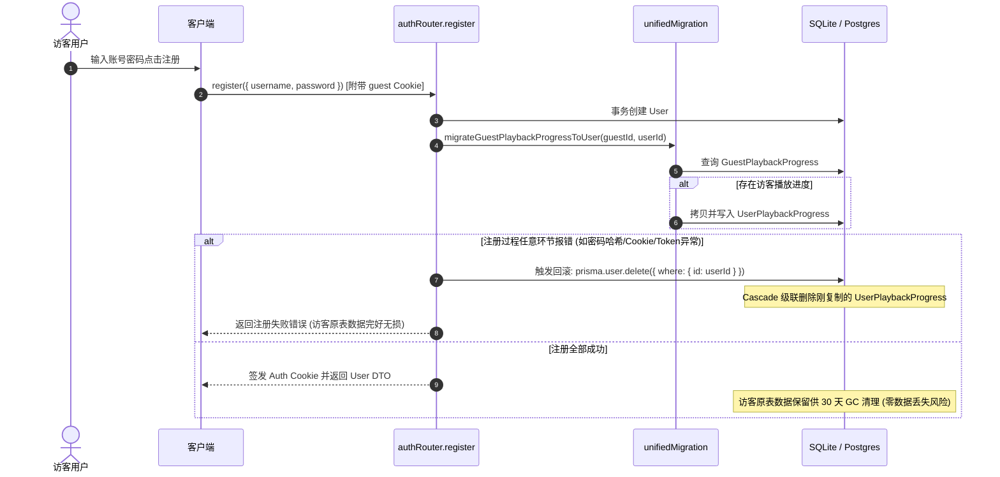
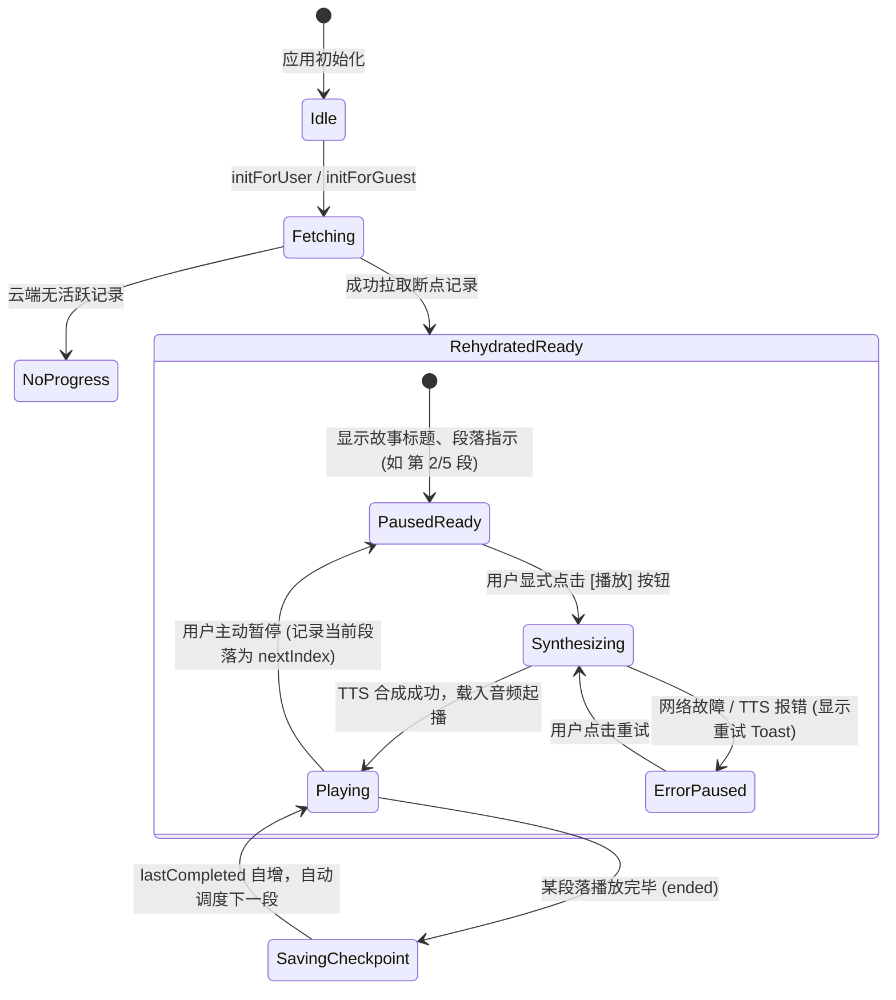

# 技术方案与实施计划：阶段二 段落级断点续播 (Phase 2 Paragraph-Boundary Resume)

> **文档类型**：实施方案与架构规范 (Implementation Plan & Architectural Specification)
> **创建日期**：2026-09-05
> **基线版本**：commit `1c495a81ac5cf35b8a11f3c78fccbb5d55002d9b` (`main`)
> **分支**：`docs/phase2-paragraph-resume`
> **作者**：DOCUMENTATION-ONLY Planning Worker
> **前序方案**：[Phase 1 Creative-Record Cloud Sync](../specs/2026-09-05-creative-record-cloud-sync.md)
> **实施范围授权**：仅规划与设计文档，本阶段严禁修改业务代码、数据库模式、迁移脚本或生产环境。

---

## 目录

1. [背景与核心裁决 (Context & Architectural Decisions)](#一背景与核心裁决)
2. [产品契约与非目标 (Product Contract & Non-Goals)](#二产品契约与非目标)
3. [源码现状与证据链 (Source Evidence & Citations)](#三源码现状与证据链)
4. [两套范围方案权衡 (Two Scope Choices)](#四两套范围方案权衡)
5. [数据架构与 API 设计 (Data & API Design)](#五数据架构与-api-设计)
6. [端云职责划分 (Device-Local vs Cloud State)](#六端云职责划分)
7. [访客注册迁移与回滚契约 (Registration Migration & Rollback)](#七访客注册迁移与回滚契约)
8. [登出、水合与多端并发冲突 (Logout, Hydration & Multi-Device Semantics)](#八登出水合与多端并发冲突)
9. [音频重合成、故障恢复与离线表现 (Regeneration, Failure & Offline Behavior)](#九音频重合成故障恢复与离线表现)
10. [30 天生命周期 GC 与容量限额 (Retention, GC & Quotas)](#十30-天生命周期-gc-与容量限额)
11. [安全鉴权、限流防御与成本模型 (Security, Rate Limits & Cost Model)](#十一安全鉴权限流防御与成本模型)
12. [回滚策略与向后兼容 (Rollback Strategy & Backward Compatibility)](#十二回滚策略与向后兼容)
13. [验收测试与 E2E 模拟矩阵 (Acceptance & E2E Matrix)](#十三验收测试与-e2e-模拟矩阵)
14. [实施任务路径清单 (Implementation Task Breakdown)](#十四实施任务路径清单)

---

## 一、背景与核心裁决

### 1.1 阶段一基石回顾
在阶段一（Phase 1: Creative-Record Cloud Sync）中，系统已实现：
- 具名访客 `g_<uuid>` 与登录用户的全量创作记录云端化（单会话聊天、故事卡片、作品生成历史、提示词历史）；
- 确立了 **ADR-3：严格坚守“正文与参数持久化，音频按需即时重合成”（No Audio Blob Persistence）** 架构红线，数据库绝不持久化任何音频二进制或临时 Blob URL；
- 确立了 **ADR-1：独立访客表物理隔离** 与 **ADR-5：仅注册时原子迁移、登录绝不覆盖** 的数据安全边界。

### 1.2 阶段二核心裁决：段落边界续播 (Paragraph-Boundary Resume)
在早期的阶段二探索中，曾探讨过记录秒级时间戳（如 `currentTime: 42.5s`）并在刷新后跳转恢复的设想。**用户最新产品决策明确否决该设想，并确立段落边界续播模型**：

1. **绝对禁止秒级/时间偏移续播（Strictly Prohibit Second-Level/Time-Offset Resume）**：
   - 依赖 OpenAI TTS 动态即时重合成的音频，每次生成的音轨时长、字间停顿、韵律语速、分块编码均存在微小浮动；
   - 旧的 `currentTime` 无法稳定映射到新合成的音频时间线上；
   - 强行 seek 进入刚开始流式加载的新音频容易导致网络缓冲卡死、爆音或从词句中间劈裂播放，体验极度劣化；
   - 音频 Blob URL 本身为浏览器内存瞬态资源（`blob:http://...`），硬刷新后立即失效，不可复用。
2. **段落边界续播模型（Paragraph-Boundary Resume Model）**：
   - 持久化**稳定创作源定位器（Creative Source Locator）**：当前主体（用户/访客）、源类型（聊天会话故事卡片 / 作品库历史条目）、溯源业务标识（`messageId` / `generationId`）；
   - 持久化**段落边界进度（Paragraph Indices）**：记录**上一完整听完的段落序号（`lastCompletedParagraphIndex`）**与**下一次应当播放的目标段落序号（`nextParagraphIndex`）**；
   - 持久化**重合成上下文（Generation Context）**：音色 `voiceId`、语速 `speed`、允许播放倒计时 `remainingAllowedMs` 与单次播放标记 `isOneShot`；
   - 重新加载或切换设备时，前端水合定位器并重新请求 TTS，从**下一个完整段落（Next Whole Paragraph）**开始合成与播放。
3. **明示产品权衡（Explicit Midway Tradeoff）**：
   - **若用户在某一段落播放中途暂停或退出，下一次续播将从该段落的开头完整重播**；
   - 系统绝不在段落中途截断音频或强行跳转。用户对“从当前小段开头重新听”的认知负荷和心理接受度，显著高于“截断单词破音”或“跳过未听完内容”。
4. **停驻就绪态契约（Land PAUSED/READY Contract）**：
   - 页面刷新或设备切换恢复后，播放器必须停驻在 **PAUSED（已暂停）/ READY（已就绪）** 状态；
   - **绝对严禁自动强行起播（Never Force Autoplay）**；
   - 必须由用户显式点击“播放 / 继续收听”按钮后，才触发手势解锁与音频回放，同时完全符合主流浏览器（Chrome, Safari, iOS WebKit）严格的 Audio Autoplay Policy。

---

## 二、产品契约与非目标

### 2.1 产品契约 (Product Contract)
1. **跨页面与刷新恢复**：用户或访客在收听故事中途硬刷新页面或关闭重开标签页，进入 `/player` 或 `/chat` 时，播放器不再表现为 `0:00 / 待创作`，而是展示上次故事的曲目名称、当前段落指示，并处于就绪暂停态。
2. **跨设备进度同步（登录用户）**：登录用户在手机端听完故事第 2 段，暂停并切换至桌面端登录，桌面端读取云端进度并在点击播放后从第 3 段起播。
3. **具名访客设备内延续**：具名访客凭借加密 HttpOnly Cookie 中的 `guestId`，在同一浏览器内刷新、重开会话后，能精准延续访客期间的段落收听进度。
4. **倒计时状态延续**：若用户设置了播放定时器（如 30 分钟睡眠陪伴），断点续播时同步继承剩余有效时长，倒计时不会因为硬刷新而被重置为初始时长。

### 2.2 明确非目标 (Non-Goals)
1. **非目标 1：秒级/帧级精确定位恢复**——不记录、不持久化 `currentTime`，不尝试 `audio.currentTime = offset`。
2. **非目标 2：音频文件/二进制持久化**——数据库、对象存储或服务器文件系统绝不保存 MP3 或 Blob 数据。
3. **非目标 3：无手势静默自动起播**——页面加载完成后绝不触发 `audio.play()`，规避浏览器安全阻断并保障收听预期。
4. **非目标 4：完全离线音频缓存（PWA Offline Audio）**——由于不存音频文件，无网络连接时无法合成新音频（离线时提供友好降级与重试引导）。
5. **非目标 5：多端毫秒级实时联播镜像（Live Mirroring）**——不构建多端 WebSocket 实时同步联播，仅同步离散段落检查点。

---

## 三、源码现状与证据链

对 `audio-player-next` 现有工程代码进行静态审视，获取以下关键事实与调用链依据：

### 3.1 播放器状态纯内存化现状
- **证据 1**：`stores/playbackStore.ts:14-42`
  定义了 `PlaybackStoreBaseState`，包含 `sessionId`, `isPlaying`, `currentSegmentIndex`, `currentTime`, `duration`, `currentAudioUrl`, `currentMessageId` 等状态。全部存储于 Zustand 内存，未挂载任何持久化中间件。
- **证据 2**：`stores/playbackStore.ts:87-103`
  `INITIAL_STATE` 在每次页面刷新时无差别将所有状态重置为 `currentTime: 0, duration: 0, currentAudioUrl: null, currentMessageId: null`。
- **证据 3**：`app/(main)/player/components/AudioPlayer/index.tsx:54`
  定义了 `const hasAudio = duration > 0;`。页面硬刷新后，因 `duration` 为 0，`hasAudio` 为 `false`，导致唱片停止、播放按钮被禁用（`disabled={!hasAudio}`，第 80-82 行阻断），完全丢失恢复能力。
- **证据 4**：`components/FloatingPlayer/index.tsx:165-166`
  `const hasTrack = currentAudioUrl !== null; const shouldShowFloatingPanel = isFloatingPlayerEnabled && isVisible && hasTrack;`
  硬刷新后因 `currentAudioUrl` 为 `null`，浮动胶囊直接隐藏或退化为“待创作”。

### 3.2 音频生命周期与无持久化契约
- **证据 5**：`lib/client/ttsGenerate.ts:20-28`
  ```typescript
  const blob = new Blob([bytes], { type: result.contentType });
  return URL.createObjectURL(blob);
  ```
  音频 URL 均由 `URL.createObjectURL` 在当前浏览器内存中临时生成，标签页卸载即被浏览器引擎注销。
- **证据 6**：`stores/chatStore.ts:166-183`
  `toSnapshot` 方法在构造持久化快照时，显式将所有 `storyCard.audioUrl` 覆盖置空为 `''`（第 173 行），坚决不存入数据库。
- **证据 7**：`docs/specs/2026-06-22-player-mirror-playback-investigation.md:27`
  历史调查记录明确确认：“`playbackStore` 为内存态、未持久化；在 `/player` 执行硬刷新会丢失播放态（且 blob 音频地址失效无法恢复），表现为 0:00。属内存态固有行为”。

### 3.3 音频宿主事件与段落推进行为
- **证据 8**：`components/AudioControllerHost/index.tsx:165-174`
  `handlePlay` 启动新音频时，强制将 `audioEl.currentTime = 0`，重置进度。
- **证据 9**：`components/AudioControllerHost/index.tsx:318-335`
  `<audio>` 触发 `ended` 事件时，调用 `handleSegmentEnded()`，随后直接调度 `handlePlay(nextSegment.audioUrl, nextSegment.messageId)` 顺序推进下一段。
- **证据 10**：`app/services/storyFlow.ts:189-209`
  `handleSegmentEnded` 优先通过 `chatStore.selectors.nextStorySegment(currentMessageId)` 查找已生成的下一段，否则调用 `preloadStore.requestPreload()` 自动以“请继续故事”触发下一章节续写。
- **证据 11**：`app/(main)/chat/components/StoryViewer/index.tsx:23-26`
  工程内部对故事正文的自然段落已有成熟切分定义：`content.split('\n').filter(p => p.trim() !== '')`。

### 3.4 账号与访客同步体系
- **证据 12**：`stores/accountSync.ts:32-57`
  `participants` 集中注册表管理各数据块的 `initForUser`、`initForGuest`、`reset`。
- **证据 13**：`stores/accountSync.ts:100-110`
  监听 `authStore.isLogin` 变化，状态跃迁时统一执行 `resetAccountData()`，保证账号切换与登出时彻底清理内存态。
- **证据 14**：`lib/server/subject.ts:10-22`
  服务端具备完善的 `Subject` 统一主体抽象（`user` 与 `guest`），可为断点续播提供完全对称的服务层支撑。

---

## 四、两套范围方案权衡

在坚守“段落边界续播、严禁时间偏移、严禁音频持久化、严禁自动起播”的产品前提下，当前系统内唯一真实存在的架构选型是**断点粒度与重合成触发时机**。以下提供两套完备范围方案供决策：


### 方案对比矩阵

| 维度 | 方案 A（推荐）：细粒度自然段 + 按需懒合成 | 方案 B（备选）：粗粒度故事卡片 + 进场预加载合成 |
| :--- | :--- | :--- |
| **段落单位定义** | 故事卡片正文内的**自然段落**（由 `\n\n` 或 `\n` 切分，每段约 100~150 字，播放时长约 30~45 秒）。 | 单张**故事卡片（StoryCard）**整体作为一段（每卡 500~800 字，播放时长约 2~3 分钟）。 |
| **中途退出重播代价** | 极低。用户在段落中途退出，下次仅重播当前 30 秒短自然段，听感重叠少。 | 较高。用户在故事卡片末尾退出，下次需从头重听整个 500~800 字的卡片音频（约 2 分钟）。 |
| **重合成触发时机** | **懒加载（Lazy On-Demand）**：刷新后仅水合文本与段落序号，展示暂停态；用户点击播放按钮时才触发 TTS 合成。 | **提前合成（Eager Pre-synthesis）**：刷新后检测到断点，立即静默发起服务端 TTS 合成并在内存生成 Blob URL，等待用户点击。 |
| **API 成本消耗** | **最优**。若用户刷新页面后只是浏览历史或直接离开，**产生 0 次 TTS API 调用**；仅在点击播放时发生调用。 | 存在浪费风险。每次刷新或打开应用均自动预调用 TTS，若用户未收听即离开，产生无意义费用。 |
| **首段起播时延** | 点击播放后有约 800ms~1.2s 的 TTS 合成等待动效（UI 呈现加载微光），后续自然段通过预加载无缝衔接。 | 点击播放瞬间 0 延迟直接起播（前提是进入页面到点击播放之间已有合成缓冲完成）。 |
| **代码与流程改造度** | 中等。需为 `storyFlow` 增加文本切段重合成调度逻辑，但完全复用现有 `fetchAudio`。 | 极低。完全复用现有的整段 `playStoryText`，仅需记录 `messageId`。 |
| **推荐裁决** | **强烈推荐采纳方案 A**：符合长音频播放器人性化续播标准，将重播惩罚降到最低，且杜绝任何空耗 TTS 费用的可能。 | 不推荐，仅作为极简过渡备选方案。 |

---

## 五、数据架构与 API 设计

遵循 Phase 1 确立的 ADR-1（独立访客表）与 ADR-2（主体感知服务层），断点续播采用双表物理隔离、统一业务实体的设计。

### 5.1 数据库模式定义 (`prisma/schema.prisma`)

```prisma
/// 用户断点播放进度表（每用户仅保留一条活跃播放锚点）
model UserPlaybackProgress {
  id                          Int      @id @default(autoincrement())
  userId                      Int      @unique
  user                        User     @relation(fields: [userId], references: [id], onDelete: Cascade)

  /// 播放源类型：'chat'（单会话故事卡片）| 'generation'（作品库历史条目）
  sourceType                  String
  /// 溯源唯一标识：chat 时为 messageId，generation 时为 string(generationId)
  sourceId                    String
  /// 会话标识（可选）
  sessionId                   String?
  /// 故事展示标题（用于断点恢复首屏展示，避免异步查主表）
  title                       String

  /// 上一次已完整听完的段落序号（从 0 开始；-1 表示该故事未听完首段）
  lastCompletedParagraphIndex Int      @default(-1)
  /// 下一次应当恢复播放的段落序号（通常为 lastCompletedParagraphIndex + 1，中途退出即重播此段）
  nextParagraphIndex          Int      @default(0)
  /// 该故事正文总段落数
  totalParagraphs             Int      @default(1)

  /// 合成语音参数上下文
  voiceId                     String   @default("")
  speed                       Float    @default(1.0)

  /// 倒计时上下文：继承定时器剩余有效毫秒数
  remainingAllowedMs          Int?
  totalAllowedMs              Int?
  /// 是否为一次性播放（作品库回放，不自动续写新章节）
  isOneShot                   Boolean  @default(false)

  updatedAt                   DateTime @updatedAt
  createdAt                   DateTime @default(now())

  @@index([userId])
}

/// 访客断点播放进度表（具名访客 guestId 唯一索引，物理隔离且受 30 天 GC 管辖）
model GuestPlaybackProgress {
  id                          Int      @id @default(autoincrement())
  guestId                     String   @unique

  /// 播放源类型：'chat' | 'generation'
  sourceType                  String
  /// 溯源唯一标识：chat 时为 messageId，generation 时为 string(generationId)
  sourceId                    String
  sessionId                   String?
  title                       String

  lastCompletedParagraphIndex Int      @default(-1)
  nextParagraphIndex          Int      @default(0)
  totalParagraphs             Int      @default(1)

  voiceId                     String   @default("")
  speed                       Float    @default(1.0)

  remainingAllowedMs          Int?
  totalAllowedMs              Int?
  isOneShot                   Boolean  @default(false)

  updatedAt                   DateTime @updatedAt
  createdAt                   DateTime @default(now())

  @@index([guestId])
  @@index([updatedAt])
}
```

### 5.2 tRPC 输入输出规范 (`lib/trpc/schemas/playback.ts`)

```typescript
import { z } from 'zod';

export const playbackSourceTypeSchema = z.enum(['chat', 'generation']);

export const playbackProgressDTOSchema = z.object({
  sourceType: playbackSourceTypeSchema,
  sourceId: z.string().min(1).max(128),
  sessionId: z.string().max(128).nullable().optional(),
  title: z.string().min(1).max(100),
  lastCompletedParagraphIndex: z.number().int().min(-1),
  nextParagraphIndex: z.number().int().min(0),
  totalParagraphs: z.number().int().min(1),
  voiceId: z.string().max(64).default(''),
  speed: z.number().min(0.25).max(4.0).default(1.0),
  remainingAllowedMs: z.number().int().min(0).nullable().optional(),
  totalAllowedMs: z.number().int().min(0).nullable().optional(),
  isOneShot: z.boolean().default(false),
  updatedAt: z.string(), // ISO 8601 字符串
});

export type PlaybackProgressDTO = z.infer<typeof playbackProgressDTOSchema>;

export const savePlaybackProgressInputSchema = z.object({
  sourceType: playbackSourceTypeSchema,
  sourceId: z.string().min(1).max(128),
  sessionId: z.string().max(128).optional(),
  title: z.string().min(1).max(100),
  lastCompletedParagraphIndex: z.number().int().min(-1),
  nextParagraphIndex: z.number().int().min(0),
  totalParagraphs: z.number().int().min(1),
  voiceId: z.string().max(64).optional(),
  speed: z.number().min(0.25).max(4.0).optional(),
  remainingAllowedMs: z.number().int().min(0).nullable().optional(),
  totalAllowedMs: z.number().int().min(0).nullable().optional(),
  isOneShot: z.boolean().optional(),
});

export type SavePlaybackProgressInput = z.infer<typeof savePlaybackProgressInputSchema>;
```

### 5.3 路由鉴权与服务层 (`lib/trpc/routers/playback.ts`)

在 tRPC 主路由树挂载 `playback: playbackRouter`：
- `playback.getProgress`：`guardedProcedure.query`，基于 `resolveSubject(ctx)` 检索当前主体的记录；
- `playback.saveProgress`：`guardedProcedure.input(savePlaybackProgressInputSchema).mutation`，执行原子 upsert；
  - 挂载限流防护：`enforceProcedureRateLimit('playback:saveProgress', ctx, { guestLimit: 60, authedLimit: 120 })`；
- `playback.clearProgress`：`guardedProcedure.mutation`，在故事播放完结或显式清空时清除记录。

---

## 六、端云职责划分

系统坚决抵制将客户端瞬态资源上云，明确划分**设备本地（Device-Local）**与**云端持久化（Cloud State）**：

| 数据项 | 归属层级 | 存储介质 | 生命周期 / 作用域 | 架构理由与约束 |
| :--- | :--- | :--- | :--- | :--- |
| **创作源定位符** (`sourceType`, `sourceId`, `title`) | **云端** | `User/GuestPlaybackProgress` 表 | 随账号或访客会话持久化 | 跨设备、跨刷新识别是哪篇故事。 |
| **段落边界序号** (`lastCompleted`, `nextIndex`) | **云端** | `User/GuestPlaybackProgress` 表 | 随账号或访客会话持久化 | 核心断点锚点，决定从第几段起播。 |
| **重合成参数上下文** (`voiceId`, `speed`, `remainingMs`) | **云端** | `User/GuestPlaybackProgress` 表 | 随账号或访客会话持久化 | 保证重新合成的音色、语速与原设定一致，睡眠定时器不失真。 |
| **音频二进制文件 (MP3 / WAV 数据)** | **严禁持久化** | 仅运行时 RAM | 瞬态内存缓存 | **ADR-3 红线**：防范存储容量爆满与数据库 I/O 耗尽。 |
| **Blob 资源地址** (`blob:http://...`) | **设备本地** | Zustand 内存 (`playbackStore`) | 仅当前浏览器标签页单次生命周期 | 浏览器安全限制，刷新即注销失效。 |
| **HTMLAudioElement 原生状态** (`currentTime`, `paused`) | **设备本地** | DOM 音频元素内存引用 | 单次播放会话 | 硬件音频上下文，多端或刷新无法复用。 |
| **手势解锁状态** (`isUnlockedRef`) | **设备本地** | React Ref (`AudioControllerHost`) | 当前页面交互上下文 | 遵守各操作系统与浏览器对音频自动播放的严格手势拦截策略。 |
| **浮动播放器屏幕坐标** (`position: {x, y}`) | **设备本地** | React State (`FloatingPlayer`) | 单一设备视口 | 各物理设备屏幕尺寸、分辨率不同，严禁云端同步坐标。 |

---

## 七、访客注册迁移与回滚契约

遵循 Phase 1 确立的 **ADR-5：注册原子迁移，登录绝不污染** 规范。



### 7.1 迁移实现规范 (`lib/server/unifiedMigration.ts`)
在 `authRouter.register` 中与配置、聊天、历史记录迁移并列执行：
```typescript
export async function migrateGuestPlaybackProgressToUser(
  guestId: string,
  userId: number
): Promise<boolean> {
  const guestProgress = await prisma.guestPlaybackProgress.findUnique({
    where: { guestId },
  });
  if (!guestProgress) {
    return false;
  }

  await prisma.userPlaybackProgress.upsert({
    where: { userId },
    create: {
      userId,
      sourceType: guestProgress.sourceType,
      sourceId: guestProgress.sourceId,
      sessionId: guestProgress.sessionId,
      title: guestProgress.title,
      lastCompletedParagraphIndex: guestProgress.lastCompletedParagraphIndex,
      nextParagraphIndex: guestProgress.nextParagraphIndex,
      totalParagraphs: guestProgress.totalParagraphs,
      voiceId: guestProgress.voiceId,
      speed: guestProgress.speed,
      remainingAllowedMs: guestProgress.remainingAllowedMs,
      totalAllowedMs: guestProgress.totalAllowedMs,
      isOneShot: guestProgress.isOneShot,
    },
    update: {
      sourceType: guestProgress.sourceType,
      sourceId: guestProgress.sourceId,
      sessionId: guestProgress.sessionId,
      title: guestProgress.title,
      lastCompletedParagraphIndex: guestProgress.lastCompletedParagraphIndex,
      nextParagraphIndex: guestProgress.nextParagraphIndex,
      totalParagraphs: guestProgress.totalParagraphs,
      voiceId: guestProgress.voiceId,
      speed: guestProgress.speed,
      remainingAllowedMs: guestProgress.remainingAllowedMs,
      totalAllowedMs: guestProgress.totalAllowedMs,
      isOneShot: guestProgress.isOneShot,
    },
  });

  return true;
}
```

### 7.2 登录（LOGIN）与登出（LOGOUT）语义
- **用户登录已存在账号（LOGIN）**：
  - **严禁数据迁移**：访客期间的临时进度绝不覆盖已存在账号的历史进度；
  - 触发 `resetAccountData()`，前端清空访客本地播放状态，直接拉取该账号云端的 `UserPlaybackProgress`。
- **用户登出（LOGOUT）**：
  - `authStore.isLogin` 下降沿触发 `resetAccountData()`；
  - 停止当前 `<audio>` 播放，注销当前 Blob URL，清空内存态进度；
  - 重置客户端为纯净访客待机态，绝不向服务端发起清空写操作（保留服务端进度供下次登录恢复）。

---

## 八、登出、水合与多端并发冲突

### 8.1 全局同步编排集成 (`stores/accountSync.ts`)
在统一账号同步注册表中新增 `playbackProgress` 参与者：

```typescript
// stores/accountSync.ts 中的 participants 注册
{
  name: 'playbackProgress',
  initForUser: () => usePlaybackProgressStore.getState().initForUser(),
  initForGuest: () => usePlaybackProgressStore.getState().initForGuest(),
  reset: () => {
    usePlaybackProgressStore.getState().reset();
    usePlaybackStore.getState().reset();
  },
}
```

### 8.2 客户端水合状态机 (Hydration State Machine)
在首屏或路由进入 `/player`、`/chat` 时：



### 8.3 多端并发冲突化解 (Multi-Device Conflict Semantics)
当同一账号在设备 A 与设备 B 同时使用时：
1. **单调前进仲裁（Monotonic Progress Rule）**：
   - 针对同一故事（相同 `sourceType` 与 `sourceId`），服务端或客户端仅接受不小于当前云端 `nextParagraphIndex` 的更新；
   - 避免设备 A 已听完第 3 段，设备 B 打开旧缓存误将进度写回第 1 段。
2. **主动会话覆写（Explicit Session Override）**：
   - 若设备 B 主动选择了另一篇全新故事（`sourceId` 改变），以最后写入者胜（Last-Write-Wins, LWW）原则更新单行活跃锚点。
3. **零广播静默（No Force Audio Interrupt）**：
   - 设备 A 在播放中时，不强制接收设备 B 的实时推送中断音频；断点仅在页面刷新、重新进入或手动点击播放时发生水合。

---

## 九、音频重合成、故障恢复与离线表现

### 9.1 段落切分与懒加载重合成流程 (Lazy Re-synthesis Flow)
当用户在水合就绪态点击“播放故事”时：
1. **正文解析**：从 `chatStore`（若为聊天故事卡片）或 `generationHistoryStore`（若为作品库历史）根据 `sourceId` 提取故事正文 `storyText`；
2. **段落提取**：通过正则/换行符切分为段落数组 `paragraphs = storyText.split(/\n+/).filter(Boolean)`；
3. **边界校验**：若目标 `nextParagraphIndex >= paragraphs.length`，判定整篇已播放完毕，UI 转换为“重新从头播放”或停驻已完成态；
4. **即时合成**：取切片正文 `const currentParagraphText = paragraphs[nextParagraphIndex]`，调用 `fetchAudio(currentParagraphText, voiceId, speed)`；
5. **无缝装载**：在 `AudioControllerHost` 中将生成的临时 Blob URL 赋值给 `<audio>`，在用户手势上下文内立即执行 `audio.play()`；
6. **就近预加载**：当前段落播放剩余 10 秒或触发 `handleNearEnd` 时，后台异步调用下一段落 `paragraphs[nextParagraphIndex + 1]` 的 TTS 合成，确保段落间听感连续无缝。

### 9.2 异常与网络中断恢复 (Failure Handling)
- **TTS 接口限流或异常**：
  - 若调用 `tts.synthesize` 遭遇 429 或 500 异常，捕获错误并通过 `GlassToast.show({ icon: 'fail', content: '语音生成稍有延迟，请重试' })`；
  - 播放器停驻在 PAUSED 态，**段落序号保持不变**，允许用户再次点击重试，不丢失断点。
- **离线断网表现 (Offline Behavior)**：
  - 若设备在无网环境下启动，界面水合展示断点信息但无法完成 TTS 合成，按钮呈现“离线待连接”状态；
  - 若在播放当前段落中途断网，已缓冲完成的当前段落可完整播完；播完尝试请求下一段落失败后，触发预加载重试（`PRELOAD_RETRY_DELAY = 5000`，最多 3 次），重试耗尽后优雅暂停，等待网络恢复。

---

## 十、30 天生命周期 GC 与容量限额

### 10.1 访客断点数据 30 天滚动清理 (`lib/server/guestGc.ts`)
由于访客无凭证即可创建断点数据，为防止无意义数据堆积，将 `GuestPlaybackProgress` 纳入现有的 30 天 GC 清理程序：

```typescript
// lib/server/guestGc.ts 扩展
export interface PurgeResult {
  configsDeleted: number;
  messagesDeleted: number;
  generationsDeleted: number;
  promptsDeleted: number;
  playbackProgressDeleted: number; // 新增指标
}

export async function purgeExpiredGuestData(cutoffDate?: Date): Promise<PurgeResult> {
  const threshold = cutoffDate ?? new Date(Date.now() - THIRTY_DAYS_MS);

  const [configs, messages, generations, prompts, playback] = await Promise.all([
    prisma.guestConfig.deleteMany({ where: { updatedAt: { lt: threshold } } }),
    prisma.guestChatMessage.deleteMany({ where: { updatedAt: { lt: threshold } } }),
    prisma.guestGenerationHistory.deleteMany({ where: { updatedAt: { lt: threshold } } }),
    prisma.guestPromptHistory.deleteMany({ where: { updatedAt: { lt: threshold } } }),
    prisma.guestPlaybackProgress.deleteMany({ where: { updatedAt: { lt: threshold } } }),
  ]);

  return {
    configsDeleted: configs.count,
    messagesDeleted: messages.count,
    generationsDeleted: generations.count,
    promptsDeleted: prompts.count,
    playbackProgressDeleted: playback.count,
  };
}
```

### 10.2 硬限额与存储开销 (Quotas & Capacity)
- **严格单行物理上限**：`userId` 与 `guestId` 均设有 `@unique` 约束。每个主体在数据库中**至多仅占 1 行数据**；
- **存储复杂度**：全量存储开销严格受控在 $O(N)$（$N$ 为活跃主体数），单行记录约 250 字节，即使拥有 100,000 名活跃访客与用户，总存储增加不足 25 MB；
- **请求负载控制**：保存断点仅在段落切换（约 30~60 秒一次）或暂停时触发，严禁每秒轮询写库。

---

## 十一、安全鉴权、限流防御与成本模型

### 11.1 安全鉴权 (Authentication & Authorization)
- `playback.getProgress` 与 `playback.saveProgress` 统一采用 `guardedProcedure`：
  - 拦截任何未携带有效 Session 且未携带合法 `guestId` Cookie 的匿名请求，直接返回 `TRPCError(UNAUTHORIZED, 401)`；
  - 数据库查询严格绑定主体条件：`where: { userId: subject.id }` 或 `where: { guestId: subject.id }`，任何主体无法越权读取或篡改其他主体的进度。

### 11.2 多维限流防御 (Rate Limiting)
- 接入 `lib/server/rateLimit.ts`：
  - 写入操作设定限流窗口：`guestLimit: 60 次/分钟`，`authedLimit: 120 次/分钟`；
  - 针对访客强制实施 `clientIp` + `guestId` 双层校验，防止恶意攻击者通过在单一 IP 上无限轮换 UUID 刷爆数据库连接池。

### 11.3 成本与 Token 控制模型 (Cost & Token Economy)
- 采用方案 A 的按需懒合成：
  - 页面水合展示阶段：**$0.00 额外调用成本**；
  - 恢复收听单段成本：单自然段约 120 字，折合约 200 字符。按 OpenAI TTS 标准版 $0.015 / 1k 字符计，**单次断点起播仅消耗约 $0.003**；
  - 避免了整篇（500~800 字）无脑重合成带来的 4x 成本浪费。

---

## 十二、回滚策略与向后兼容

### 12.1 零破坏性向后兼容 (100% Backward Compatibility)
- **完全增量 DDL（Additive Only）**：
  - 新增 `UserPlaybackProgress` 与 `GuestPlaybackProgress` 两张独立新表；
  - 完全不动已有的 `ChatMessage`、`GuestChatMessage`、`GenerationHistory` 等核心创作表结构；
  - 既有客户端即便不更新，调用旧接口亦不受任何结构影响。
- **软降级能力（Graceful Fallback）**：
  - 若客户端拉取断点时发现 `sourceId` 对应的聊天卡片或作品历史已在服务端被用户删除，前端安全重置为初始空闲态，不报错崩溃。

### 12.2 回滚预案 (Rollback Plan)
1. **代码级快速回退**：若断点续播前端逻辑出现不可预知异常，可通过关闭断点水合标记或还原客户端组件逻辑，系统立即平滑退回到 Phase 1 状态（硬刷新显示 0:00，用户仍可正常在卡片上点击重新播放）；
2. **数据模式回退**：执行 `DROP TABLE "UserPlaybackProgress"; DROP TABLE "GuestPlaybackProgress";` 即可完全移除，无需对其他业务数据做任何复杂清洗。

---

## 十三、验收测试与 E2E 模拟矩阵

| 用例编号 | 场景类别 | 前置状态与测试操作 | 预期检验结果 (Pass Criteria) |
| :--- | :--- | :--- | :--- |
| **TC-P2-01** | **具名访客硬刷新段落断点恢复** | 访客 `g_test1` 播放故事至第 2 段结束，暂停于第 3 段中途；执行浏览器强制刷新。 | ① 页面拉取 `getProgress` 返回 `nextParagraphIndex = 2`；<br>② 播放器显示故事标题，**停驻在 PAUSED/READY 态，无自动播放**；<br>③ 点击播放后，仅对第 3 段文本发起 TTS 合成并起播。 |
| **TC-P2-02** | **中途暂停重播整段契约** | 用户收听第 2 段（40 秒长），在第 15 秒处点击暂停并刷新页面。 | 重新点击播放时，从第 2 段开头（第 0 秒）重新完整播放，不截断破音，不 seek。 |
| **TC-P2-03** | **登录用户跨设备/跨浏览器同步** | 用户 `U_100` 在 Chrome 听完第 3 段；打开 Safari 登录该账号进入播放器。 | ① Safari 播放器水合展示第 4 段就绪；<br>② 点击播放后无缝衔接第 4 段音频。 |
| **TC-P2-04** | **睡眠倒计时时长断点继承** | 设定 30 分钟播放定时，播放 5 分钟后剩余 25 分钟；硬刷新页面。 | 水合后 `remainingAllowedMs` 准确恢复为约 25 分钟对应数值，倒计时定时器不被重置。 |
| **TC-P2-05** | **访客注册原子迁移** | 访客 `g_test2` 拥有断点播放记录；提交注册新用户。 | ① 新建用户表包含对应的 `UserPlaybackProgress` 记录；<br>② 原 `GuestPlaybackProgress` 数据保留供 30 天自然 GC。 |
| **TC-P2-06** | **访客注册失败级联回滚** | 访客提交注册，模拟数据库后续事务发生冲突报错。 | ① 触发异常捕获与级联删除；<br>② 访客原有的 `GuestPlaybackProgress` 完好无损，访客态收听进度不丢失。 |
| **TC-P2-07** | **访客登录老账号隔离** | 访客拥有故事 A 的播放进度；点击登录已有账号 B（其云端拥有故事 B 的进度）。 | ① 登录后彻底清除故事 A 本地状态；<br>② 播放器展示账号 B 的故事 B 断点进度；故事 A 绝不污染账号 B。 |
| **TC-P2-08** | **登出清理与无向后污染** | 用户处于故事播放中断点就绪态；点击退出登录。 | ① 本地 `playbackStore` 与 `playbackProgressStore` 同步清空；<br>② 停止一切正在播放的音频；<br>③ 服务端原有用户断点数据保留不变。 |
| **TC-P2-09** | **故事完全播毕自动注销** | 故事全剧 5 段全部播放完成。 | 触发 `clearProgress` 或标记完成；再次刷新不再提示恢复上一篇已完结故事。 |
| **TC-P2-10** | **30 天访客过期数据批量 GC** | 将某访客断点记录的 `updatedAt` 模拟调整至 31 天前；调用 `purgeExpiredGuestData`。 | 该访客断点行被物理删除，未过期的其他访客与用户记录完好无损。 |
| **TC-P2-11** | **匿名未授权请求 401 拦截** | 清除 Cookie 与凭据，直接向 `playback.getProgress` / `saveProgress` 发送请求。 | 返回 `TRPCError` 状态码 401 (`UNAUTHORIZED`)。 |
| **TC-P2-12** | **高频保存限流防御** | 模拟脚本快速并发调用 `playback.saveProgress`（超过 60 次/分）。 | 触发 `enforceProcedureRateLimit`，返回 429 (`TOO_MANY_REQUESTS`)。 |
| **TC-P2-13** | **断网与 TTS 异常降级** | 恢复播放点击时模拟断网或 OpenAI TTS 抛错。 | ① 弹出“语音生成失败，请重试”轻提示；<br>② 进度序号不倒退也不前跳；<br>③ 恢复网络后点击可重新成功起播。 |
| **TC-P2-14** | **关联故事被删除防御** | 恢复定位器所指向的 `ChatMessage` 或作品记录已被手动删除。 | 水合检测到源丢失，安全重置为空闲待创作状态，控制台输出警告，页面不崩溃。 |

---

## 十四、实施任务路径清单

实施阶段应严格遵循以下文件路径拆分推进（当前为规划状态，未直接变更代码）：

### 任务 1：数据库模式与增量迁移
- **目标路径**：
  - `prisma/schema.prisma`：定义 `UserPlaybackProgress` 与 `GuestPlaybackProgress` 模型；
  - `prisma/migrations/20260905140000_add_playback_progress/migration.sql`：生成增量迁移 SQL；
  - 执行 `npx prisma generate` 更新类型定义。

### 任务 2：tRPC 契约与传输对象
- **目标路径**：
  - `lib/trpc/schemas/playback.ts`：定义断点进度 DTO、查询与保存的 Zod 校验模式；
  - `types/playback.ts`：导出前端消费的断点数据类型与重合成上下文类型。

### 任务 3：服务端主体感知服务层实现
- **目标路径**：
  - `lib/server/playbackProgress.ts`：封装 `getPlaybackProgressForSubject`、`savePlaybackProgressForSubject`、`clearPlaybackProgressForSubject`。

### 任务 4：tRPC 路由挂载与限流防护
- **目标路径**：
  - `lib/trpc/routers/playback.ts`：创建受保护的 `playbackRouter`（`guardedProcedure` + `rateLimit`）；
  - `lib/trpc/root.ts`：在全局 API 树挂载 `playback` 路由。

### 任务 5：访客注册原子迁移集成
- **目标路径**：
  - `lib/server/unifiedMigration.ts`：添加 `migrateGuestPlaybackProgressToUser` 方法；
  - `lib/trpc/routers/auth.ts`：在 `auth.register` 注册成功逻辑中挂载断点迁移与异常级联回滚。

### 任务 6：30 天生命周期 GC 服务扩充
- **目标路径**：
  - `lib/server/guestGc.ts`：在 `purgeExpiredGuestData` 中追加 `GuestPlaybackProgress` 的 30 天过期清理逻辑。

### 任务 7：客户端存储状态机与持久化通信
- **目标路径**：
  - `lib/client/playbackProgress.ts`：封装前端 tRPC 客户端通信方法；
  - `stores/playbackProgressStore.ts`：构建断点专用状态机（管理断点拉取、防抖保存、水合就绪态）。

### 任务 8：全局账号同步生命周期接入
- **目标路径**：
  - `stores/accountSync.ts`：在 `participants` 中接入 `playbackProgress` 的 `initForUser`、`initForGuest`、`reset`。

### 任务 9：音频控制链路与自然段重合成改造
- **目标路径**：
  - `stores/playbackStore.ts`：扩展 `PlaybackStoreBaseState`，支持段落断点水合（注入 `sourceLocator` 与 `paragraphProgress`）；
  - `app/services/storyFlow.ts`：实现自然段切分、断点重合成函数 `resumeStoryFromParagraph`，并在 `handleSegmentEnded` 中调度断点保存；
  - `components/AudioControllerHost/index.tsx`：确保断点恢复后进入 PAUSED/READY 态，并在用户点击时平滑起播。

### 任务 10：视图层断点就绪卡片与播放器镜像展示
- **目标路径**：
  - `app/(main)/player/components/AudioPlayer/index.tsx`：恢复态下解除 `duration > 0` 的死锁，展示断点曲目与段落进度；
  - `app/(main)/chat/components/MessageParts/StoryCardPart.tsx`：支持故事卡片展示“从第 X 段继续收听”的交互按钮；
  - `components/FloatingPlayer/index.tsx`：支持在断点就绪态优雅唤醒胶囊，展示收听倒计时与断点标题。

### 任务 11：全量单元与 E2E 模拟验证套件
- **目标路径**：
  - `tests/test-paragraph-resume.ts`：落实 TC-P2-01 至 TC-P2-14 的端到端自动化模拟用例集。
