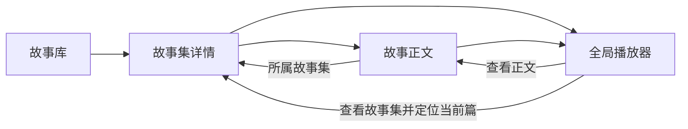

# 故事库、集内管理与播放器导航改进提案

状态：核心闭环已进入实现与交付验证；本文保留调研与后续方向，实际本次范围以[实现契约](2026-10-08-story-library-navigation-and-listening-contract.md)为准，不将提案中的所有远期功能视为已实现。

本轮角色：Planner。change-id：`2026-10-08-story-library-experience`。工作目录：`/Users/tensho/Developments/audio-player-next`。调研基线：`main`，`c58cddd3baeae199fdffd921c1b5def100df36f6`。授权范围：只读产品与实现调研、编写本提案；不修改业务实现。证据位置：下文仓库文件与公开产品文档。

## 结论与调研边界

建议把故事库升级为“找到故事集 → 选篇阅读或续听 → 播放时随时返回故事集 → 管理单篇”的完整入口。先补导航、断点和生命周期规则，再做展示和整集连播。

本次调查覆盖当前产品契约、页面组件、数据契约、服务端查询、播放流程、进度表和现有浏览器旅程，并参考 Apple Podcasts 与 Spotify 的官方交互说明。没有启动服务、读取用户数据或进行本轮可见 UI 实测；下文“现状”是代码可确认行为，视觉效果、实际耗时和用户频率仍待实施前用合成数据验证。外部参照用于支持设计方向，不证明本项目用户已经需要所有功能。

现行权威见[创作与播放契约](2026-10-07-creation-and-playback-contract.md)、[测试入口](../testing/README.md)与[设计规范](../../DESIGN_SPEC.md)。实现前应将采纳的行为写入新契约，保留已发布历史文档。

## 当前旅程与问题证据

| 现状与证据 | 用户影响 | 建议优先度 |
| --- | --- | --- |
| [集合卡片](../../app/(main)/library/components/CollectionCard.tsx)展示标题、篇数、收藏和直接删除；没有摘要、续听或播放入口，详情链接只在标题上 | 难以区分相似集合；进入后才知道听什么；删除比收听更显眼 | 首批 |
| [集合详情](../../app/(main)/library/collections/[id]/index.tsx)按 position 展示标题、摘要与播放按钮；成员标题无详情链接，成员管理入口缺失 | 集内可播放，却难以阅读全文、改名、收藏或删除单篇 | 首批 |
| [单篇详情](../../components/Library/StoryDetail.tsx)只能返回故事库，缺少播放入口；常规界面展示内部 ID、Hash、来源消息和原始音频枚举 | 从播放器看正文后丢失集合上下文；阅读页不能直接续听；技术信息挤占内容 | 首批 |
| [播放器内容动作](../../components/NowPlaying/NowPlayingActions.tsx)与[导航 helper](../../components/NowPlaying/workViewStoryNavigation.ts)仅提供 Work 正文跳转；[Work DTO](../../lib/trpc/schemas/library.ts)有 collectionTitle，没有 collectionId | 知道集名，但无法可靠跳回所属集并定位当前篇；不能由标题反查或拼接集合地址 | 首批 |
| [播放入口](../../app/services/playbackSessionFlow.ts)同源支持暂停、继续、重播，但切换到另一 Work 使用 beginPlayback(mode: restart) | A → B → A 会从头开始；仅当前内存会话的“继续”不能覆盖跨篇断点续听 | 首批 |
| [详情页](../../app/(main)/library/[id]/index.tsx)将 progress 注入为 null；[进度表](../../prisma/schema.prisma)已有 positionMs、durationMs、completedAt、lastPlayedAt | 已有保存能力没有转化为故事库中的“听到哪里”和“继续听” | 首批 |
| [集合查询](../../lib/server/storyCollection.ts)正常集内成员只过滤 position，未过滤 deletedAt；篇数统计包含全部成员；搜索成员也不区分删除状态 | 单篇删除后可能仍被集内展示、计数或用于搜索命中，与单篇 get 不可用规则冲突 | 管理功能前置 |
| 同一服务的集合 restore 清空所有已删除成员的 deletedAt，没有区分此前单独删除与随集合删除 | 整集恢复可能复活用户此前明确删除的单篇 | 管理功能前置 |
| [单篇 mutation](../../lib/client/libraryMutations.ts)与[集合 mutation](../../lib/client/collectionMutations.ts)各自更新自己的 query 家族 | 单篇改名、删除、收藏后，集合列表、成员和播放器标题缺少统一同步契约 | 管理功能前置 |
| [音频列表投影](../../lib/server/storyWork.ts)读取 StoryAudioManifest，当前正式播放采用 StoryAudioAsset | 列表状态、时长与实际单轨播放可能不同；新增时长展示前须统一读源 | 展示功能前置 |
| [单篇卡片](../../app/(main)/library/components/StoryWorkCard.tsx)仍含禁用的旧播放按钮，但[故事库主页](../../app/(main)/library/index.tsx)只渲染 CollectionCard | 属于遗留复用风险，不能据此断言当前故事库的播放按钮被禁用 | 实施时核查复用范围 |

目前没有整集回听队列的用户入口。现有“连续创作”负责生成下一篇新故事，不能直接作为历史故事集连播复用。

## 外部交互参照与取舍

Apple Podcasts 将单集播放、单集更多菜单、Play Next 和 Add to Queue 分开，并从 Mini 展开后进入队列。这支持“单篇主操作明确、管理收进菜单、播放顺序在播放器内可见”的方向。[Apple 官方说明](https://support.apple.com/en-mide/118668)

Spotify 明确将 Play Queue 用于查看和安排接下来播放的内容。这支持让用户看见“当前篇和接下来是什么”，而不是在后台隐式切换。[Spotify 官方说明](https://support.spotify.com/md-en/article/play-queue/)

本项目首版只需要单集内顺序回听。跨集混排、拖拽队列、随机播放和多种队列来源留待后续需求；这些能力会显著增加状态和恢复复杂度。

## 建议的信息结构与跳转规则

用户界面统一使用“故事集”和“故事”；Collection / Work 只用于实现。保持一级导航为创作、故事库、设置，沿用全局 Mini 与展开播放器。`/player` 保留兼容跳转，不新增独立播放器页面。

- 浏览动作只改变页面，不切曲、不重建播放会话。进入别的故事集浏览时，旧音频继续播放；只有显式播放新篇才交接播放与取消原播放相关在途任务。该规则需与当前契约中“切集合”的业务含义一并澄清。
- 集内标题进入正文，播放按钮原位播放。单篇正文提供“返回《故事集名》”与播放/暂停/继续入口；无所属集的旧作品回退故事库。
- 展开播放器的集合标题或“查看故事集”指向经过归属验证的 collectionId，定位当前 workId；“查看正文”继续指向当前 Work。已经位于目标页时关闭播放器并定位，不重复 push。
- 返回列表保留 view、q、排序、已加载分页与滚动锚点；返回故事集保留当前篇位置。浏览器返回遵循真实历史，外链直入则使用明确的父级回退。
- 不把任意 returnTo 外部地址当导航目标；只接受应用内已验证路径。集合被删除或归属失效时提供“内容已不可用”和回故事库入口。
- 播放浮层关闭后焦点回到触发入口；正文、集名、菜单和播放按钮各有独立语义，不采用嵌套交互元素。

## 创作、播放器与故事集的完整交互

### 三个界面的职责与现有断点

用户的对象始终是“我正在创作或收听的这组故事”。创作工作台负责输入、生成和续写；故事集负责查看已保存内容与整理；播放器是跨页面共享的收听层。页面切换应是换一个角度看同一内容，不能等同于新建内容或切换播放。

本轮补充调查：[创作布局](../../app/(main)/chat/components/ChatLayout/index.tsx)、[创作集名栏](../../app/(main)/chat/components/ContinuousCreationBar/index.tsx)、[创作故事卡](../../app/(main)/chat/components/MessageParts/StoryArtifactPart.tsx)、[创作返回动作](../../components/NowPlaying/creationActions.ts)、[会话 API](../../lib/trpc/routers/conversation.ts)、[新建流程](../../app/services/startNewCreation.ts)和[连续创作编排](../../app/services/continuousCreationFlow.ts)。依然为代码调研，未做本轮 UI 实测。

可确认的断点：

- 创作页拥有 collectionId/标题，集名栏却只渲染文本，缺少进入集详情的入口；创作故事卡保存完成后也没有集合导航。
- 创作卡的“查看全文”打开独立 StoryViewer，标题为“故事文本”；已保存内容又存在单篇正文页。同一故事的阅读入口、标题和管理能力不统一。
- Draft 在播放器中可“返回创作”，晋升正式 Work 后改为正文导航；Work 的“继续创作”仍恒隐藏。保存身份变化使来源创作的回路消失。
- `/chat` 恢复当前 active Conversation，不是任意正在播放故事的来源会话。播放旧集时跳 `/chat` 不能代表“回到这篇故事的创作”。
- 会话服务可读取 active/closed 会话，但没有恢复旧会话为编辑目标的接口；一主体至多一个 active。不能只替换客户端 collectionId 就宣称完成历史集续写。
- 当前新建流程保留服务端旧会话与已保存集合，但可见确认文案为“当前会话内容将被清空”，易使人误以为历史故事会被删除。

### 共享上下文与标题

统一展示“故事集名 → 当前故事标题”，创作、集详情和播放器使用同一已验证归属投影。创作页在有正式集合时显示可点击集名、已保存篇数和“查看故事集”；首篇保存前显示“新故事集”，不生成假链接。单篇保存成功用“已保存到《集名》”弱提示承接，不抢占播放主操作。

必须区分“当前编辑的故事集”和“当前播放的故事集”：用户在创作 B 时可以听 A，不能为了标题一致把 B 的标题覆盖进 A 的播放器。此时 Mini 明确显示“正在收听《A》”，创作页仍显示“正在创作《B》”；需要时提供轻量“返回正在收听的故事集”，不使用会遮挡输入的常驻警告。

所有播放按钮按 workId 匹配同一会话并表达播放、准备、暂停、继续、重播与失败重试。用户在创作卡点播放，集内对应行和 Mini 立即反映同一个状态；换页不需要重新开始。

### 一组明确的动作，而非模糊的“继续”

| 用户意图 | 可见动作与结果 | 播放与生成副作用 |
| --- | --- | --- |
| 从创作查看保存成果 | 点击集名/“查看故事集”，进入所属集，定位新保存篇 | 保留当前声音与任务；纯浏览不取消连续创作 |
| 创作卡阅读全文 | 已保存 Work 打开规范正文页；未保存草稿保留局部全文阅读 | 不切曲；返回后保留输入草稿与消息锚点 |
| 从播放器整理内容 | “查看故事集”进入所属集并定位当前篇 | 不暂停、不触发新内容 |
| 从集/正文/播放器找创作来源 | “查看创作记录”进入该集来源会话，并定位对应消息（存在来源映射时） | 只读取；不能退回无身份 `/chat` 并假装是来源 |
| 返回正在编辑的来源集 | 来源就是当前 active 会话时使用“返回创作” | 恢复编辑位置，不发送、不重置播放 |
| 想给这个集追加下一篇 | “续写这个故事集”恢复该集为编辑目标，展示上下文与输入框 | 准备编辑本身不生成；用户提交才创建下一篇 |
| 从某篇另开故事方向 | 后续“基于这篇新建”明确建立新集/分支 | 不偷偷追加到原集；首版暂缓 |
| 想换一个全新主题 | “新建故事集”执行现有新建强重置与持久化边界 | 停止播放及旧自动任务；保留已保存内容，清楚表达副作用 |

“继续听”只恢复音频，“续写”只建立编辑上下文，“生成下一篇”才是内容创建动作。正式内容的来源导航和续写入口无需等生成能力交付后才出现；没有恢复编辑契约时先提供可读取的创作记录，不能放一个实际无效的续写按钮。

### 来源创作的路径与历史集续写

沿用 `/chat` 作为当前创作入口，增加 `/chat/conversations/:conversationId` 作为明确来源会话地址。它表达工作台资源身份，不是故事正文的第二个地址；父级导航归属创作 Tab，页面同时显示所属集链接。当前 active 的来源会话可编辑；closed 会话默认只读，显示“创作记录”和显式“续写这个故事集”。进入 URL、刷新、查看记录均不自动激活历史会话。

来源解析由服务端验证 Subject、collectionId、conversationId 和可用性，不从 sourceMessageId 推测 conversationId。只有已验证且存在的来源映射才提供消息定位；旧孤立作品提供正文与回库，不虚构创作来源。

历史集续写建议恢复原 Conversation 为 active，继续向原 Collection 追加，首版不建立隐式分支。需要新增服务端原子恢复编辑契约：验证目标归属与集合可用性、校验客户端已知的旧 active 身份、关闭旧 active、激活目标；保留旧会话/集合与消息，覆盖 User/Guest 对称路径及多标签页冲突。closed 从此表达“非当前编辑”而非永久不可再开，该语义变化需另写契约并检查所有状态使用点。

在恢复编辑前保存当前输入草稿；若旧生成尚在途或草稿无法安全保存，使用应用内切换面板明确展示受影响内容与“保留当前创作/切换”动作。日常无风险切换直接完成，不逐次弹确认。加载目标失败时保留原编辑上下文，不能先清空再发现目标不可用。

切换编辑目标取消旧创作调度和迟到写入，但单纯准备新编辑目标不打断手动收听的有效音频。原自动创作驱动的播放转换为单篇收听、停用旧自动交接；用户提交下一篇后才按新编辑目标建立新的创作任务。旧集恢复时连续创作默认关闭，待明确开启；避免用户一进历史集就开始产生新内容。此处与新建时默认连续开启区分，并作为现行契约的明确拟变更。

### 自动创作、回听与手动收听的协调

前文整集连播为已保存故事的回听模式；现有连续创作为“边听边创作下一篇”。用户文案应说清行为，而非把两者都称为连续播放。播放器展示当前活动模式，以及“接下来：已有故事标题”或“下一篇：正在创作/准备语音”。创作页的自动开关和播放器对应模式由同一编排状态派生，不能各自独立开关。

只有一个活动播放编排拥有自动交接权。显式“听整集”停止旧自动创作并取消其待生成/待播任务；“边听边创作”在明确的可编辑集上建立创作编排并替换回听队列。只打开某个页面、查看正文或恢复编辑上下文不会切换播放模式。

手动选择历史篇优先于旧自动播放承诺；新篇保存后先呈现在正确故事集和创作卡里，若用户已转去听另一篇，晚到的保存或 TTS 不得夺回声音。保留现行首篇自动播放体验，但将自动播放承诺绑定到发起创作的上下文与最新用户播放意图；已失效时显示“已保存，可播放”。新增内容的通知为轻量状态提示，不强制导航或滚走用户正在阅读的位置。

自动创作运行中从创作页进入所属故事集，播放与下一篇状态继续可见；对应集展示“下一篇正在创作”轻提示和返回创作入口。可以浏览其他集而不中止任务；显式起播另一集时才交接编排。停止边听边创作应清楚说明“取消未完成下一篇，已保存故事保留”，不要让关闭开关看起来等于删除内容。

睡眠定时与自动创作预算分别显示为“停止收听时间”和“本次自动创作收听预算”，不把两个倒计时都简写为“剩余”。所有自动模式只有一个合法终止与下一篇起播边界，定时/预算耗尽后迟到任务不能起播。

### 新建、阅读与过渡体验

新建继续采用现行强重置，不在本提案中暗改其停止播放行为。按钮建议改为“新建故事集”，辅文为“已保存的故事会保留；开始新集会停止当前收听和自动创作”。只有确有未保存输入/生成结果需要裁决时展示应用内确认，不再仅凭 messages 非空判断风险。操作失败明确显示新集未创建成功并可重试，旧结果不得复活。

已保存故事只使用规范正文阅读页与统一播放操作；创作侧 StoryViewer 保留为草稿阅读容器。Draft → Work 晋升时不强制关闭正在读的草稿全文或跳页，下次从已保存卡进入正文才使用正式地址。草稿播放器也保留“返回创作”，转为 Work 后增加而非丢失真实来源记录入口。

进入集、正文或创作记录时显示就地加载，标题与播放区域尽量稳定；关闭展开播放器回到原页面不触发另一套路由。页面离开期间保留输入草稿与浏览锚点；恢复后不给用户再展示首访欢迎页。跨页草稿保留需按 Subject + conversationId 隔离，登出清理，禁止把未验证旧草稿写入新集。

### 交付安排与可见验收

首个导航交付同时补“创作到集”的正向入口、已保存内容统一正文以及播放器/集的真实来源记录；这几项属于闭环基础。历史集恢复编辑涉及持久化状态变化，作为单独交付置于整集回听之前或并列，不阻塞前面的纯导航改善；恢复契约完成后才开放续写按钮。跨集分支仍暂缓。

复用当前创作与集合旅程，验证“创作并保存 → 集内查看 → 播放器看正文 → 返回来源创作”始终显示同一归属、只保存一次、只使用一个播放会话。再以一条完整历史续写旅程证明：查看旧集不改 active，显式续写保留原集与已有篇，提交后新篇只追加到该集；切换失败不丢当前输入；多标签页冲突明确可见。

关键反向场景：创作 B 时听 A，各自标题与按钮对象准确；保存/TTS 晚到不打断手动收听；离开创作页不会因路由卸载取消合法下一篇任务；新建后的旧任务不写回；草稿全文晋升不突跳；刷新来源记录不偷偷续写或播放。视觉表达验证窄屏 Mini、输入框、集头与状态提示没有重复控制和遮挡。

## 页面路径层级规范

### 规范目标与路径表

目前集合详情为 `/library/collections/[id]`，单篇正文为 `/library/[id]`，路径无法表达单篇属于哪个故事集。建议将资源归属写入路径，收藏、回收站作为故事库下的独立管理页面；播放器仍是全局交互层。

| 页面 | 建议规范路径 | 父级与用途 |
| --- | --- | --- |
| 故事库 | `/library` | 正常故事集浏览入口 |
| 故事集详情 | `/library/collections/:collectionId` | 父级故事库；集内浏览与管理 |
| 集内故事正文 | `/library/collections/:collectionId/works/:workId` | 父级所属故事集；阅读与单篇播放 |
| 无所属集的历史故事 | `/library/works/:workId` | 父级故事库；仅为没有 collectionId 的有效故事提供正文 |
| 收藏 | `/library/favorites` | 故事库下的管理视图，范围用 `type=collections\|works` |
| 回收站 | `/library/trash` | 故事库下的管理视图，范围用 `type=collections\|works`；不提供正常详情/播放入口 |
| 创作 | `/chat` | 保留当前一级路径，后续如改名须单独统一兼容 |
| 指定创作会话/来源记录 | `/chat/conversations/:conversationId` | 归属创作 Tab；active 可编辑，closed 默认只读，显式恢复后续写 |
| 设置 | `/setting` | 保留当前一级路径 |

路径中的 `collections` 和 `works` 对齐领域资源；用户界面的文案仍为故事集、故事。动态参数明确命名为 collectionId、workId，避免不同层复用模糊的 id。不以故事标题或 position 作路由身份，改名、删除中间篇不改变其他故事地址。

建议 App Router 目录按相同父子层级组织。共享 `/library` layout 保持撤销提示等跨页状态；集合范围 layout 可承载所属集导航和加载/不可用边界。全局播放宿主继续由主布局持有，不能因进入集内正文而重新挂载。父子 layout 不应机械重复查询完整成员与正文，归属数据通过最小读取契约共享。

### 路径、查询参数与瞬时状态的分工

- pathname 表达页面类型和资源归属。query 只表达视图条件：搜索 `q`、排序 `sort`、收藏/回收站范围 `type`、集内筛选 `filter`，以及返回集时的 `focusWork` 定位目标。
- `/library` 保持正常集列表；收藏和回收站采用独立路径后不再同时维护 `view` 参数。不出现 `/library/trash?view=active` 这类互相矛盾的组合。
- 示例：`/library/favorites?type=works&q=月亮` 表示搜索收藏单篇；`/library/collections/<collectionId>?focusWork=<workId>` 表示浏览指定集并定位某篇，不代表起播。
- 播放/暂停、播放位置、展开播放器、准备任务、管理菜单和重命名对话框不写进资源路径。打开正文 URL 永远不自动起播，也不自动触发生成。
- 用户切页面/筛选范围用 push，搜索输入防抖用 replace；定位当前篇不需要制造连续历史记录。返回来源与滚动锚点由经过校验的站内导航上下文保存，资源地址不依赖必须携带 returnTo 才能工作。
- query 值采用白名单与既有长度限制；无效值归一到默认值。query 变化参与查询缓存与游标身份，不能复用其他过滤条件的分页游标。

### 唯一正文地址与归属校验

有所属集的故事以嵌套路径作为唯一正式正文地址，`/library/works/:workId` 只作为解析入口：服务端验证当前 Subject 与故事可用性，取得有效所属集后跳到嵌套路径；没有所属集才展示独立正文。这样播放器仍以 workId 为身份，也能可靠定位正式页面。

嵌套正文必须同时验证 workId 属于 collectionId、集合和故事均可用、主体归属正确。不能先读取故事然后仅用 URL 中的集合标题展示上下文。路径中父集不匹配、删除、跨主体或不存在时统一不可用，不泄漏真正所属集信息。合法但错配的嵌套路径不静默跳转到另一个集合。

播放器导航优先使用已验证的 Work 归属投影；仅有 workId 时可进入上述解析入口。导航目标不能由 collectionTitle 猜测，不能让用户控制的 query 决定资源归属。无归属作品不自动创建或迁移进新集合。

### 返回与面包屑

- 集内正文的资源面包屑恒为“故事库 → 故事集 → 故事”，即使它从收藏、搜索或播放器打开。
- “返回上一页”按真实站内历史回到来源并恢复筛选/滚动；“所属故事集”始终走父级资源导航。两者不能用同一个按钮承载不同含义。
- 外链直入或没有可信站内来源时，返回回退到父集；独立故事回到故事库。不能仅调用 browser back，导致跳出应用。
- 从播放器“查看故事集”关闭浮层后导航并定位当前故事；普通返回集只恢复浏览锚点，不强制滚到正在播放的另一篇。
- 所有 `/library/**` 页面激活故事库一级导航；收藏、回收站不新增一级 Tab。回收站恢复动作结束后保留管理上下文，不自动打开详情或播放。

### 旧路径兼容与迁移顺序

| 现有入口 | 迁移行为 |
| --- | --- |
| `/library/:workId` | 保留轻量服务端解析入口；验证可用性与归属后直接跳正式嵌套/独立地址，避免多跳转链 |
| `/library/collections/:id` | URL 保持，目录参数可改为 collectionId；成员正文链接更新为规范嵌套路径 |
| `/library?view=favorites`、`/library?view=trash` | 归一到 `/library/favorites`、`/library/trash`，保留合法 q 和可映射排序，type 默认 collections |
| `/library?view=active` | 归一到 `/library`，移除 view，保留合法搜索与排序 |
| `/player` | 继续跳 `/library`；不把兼容页重新实现为另一套播放器 |

需要鉴权与数据库归属解析的旧 Work 入口使用服务端临时重定向，避免浏览器永久缓存主体相关目标；纯静态兼容跳转是否永久化在实施时统一决定。重定向只读，不产生进度写入、播放或生成副作用。

实施顺序：先定义集中式路由构造/解析函数和归属读取契约；再建立规范页面与旧入口兼容；然后同时迁移集合行、收藏、搜索、正文、Mini/Expanded 导航；最后核查浏览器历史、主导航匹配、撤销 provider 和既有旅程。禁止页面分散拼接 URL。旧路径兼容保留到明确的退役决策，历史文档中的旧路径不批量改写。

路径改造属于首个“找得到、回得去、接着听”交付的前置工作。收藏/回收站独立路径与单篇范围入口可随管理交付落地。验收需补充：旧链接到正确正文、父子错配不可用、跨主体不可探测、刷新直入父级完整、搜索返回上下文保留、路由跳转不重建播放宿主。

## 页面改进

### 故事库：让集合可辨认、可续听

卡片显示集名、一小段内容预览、有效篇数、更新时间和收听状态。预览优先复用首篇有效摘要，不在首版增加 AI 摘要或封面生成。装饰可用既有 Token 与确定性视觉元素。

主操作为“继续听”或“开始听”，次级入口为进入故事集。收藏保留轻量快捷入口，改名与移入回收站收入更多菜单。整卡可见浏览区域可进入详情，但主操作和菜单不能误触导航。

首批保留当前服务端创建时间排序。后续支持“最近创建 / 最近更新 / 最近收听”；排序必须在服务端完成并纳入 cursor 与 query identity，不能客户端重排当前分页制造漏项。搜索命中单篇时展示命中故事标题/摘要片段及所属集，可直接定位该篇；不改变无搜索时顶层恒为集合的结构。

时长不齐时显示“已知音频合计 …，部分待准备”，不将部分合计当整集时长。未知进度不伪造百分比；没有记录显示“未听”。

### 故事集详情：同时服务浏览、收听与管理

头部保留集名、篇数与收藏，增加“继续听”；整集连播上线后再增加“从头听整集”。管理收入更多菜单，移入回收站不再与主播放并列占据重点。

集内改为紧凑故事行：展示顺序、可点击标题、简短摘要、已知时长、收听状态、独立播放按钮和更多菜单。当前播放行用视觉标识与文字共同表达，不单靠颜色。

更多菜单支持查看正文、重命名、收藏单篇、从头播放、移入回收站。按需提供集内搜索与“全部 / 未听完 / 已收藏”筛选；首版不拖拽重排、不移动故事到其他集。position 保持创作顺序和持久化身份；删除后的可见序号可连续展示，不能为美观重写 position。

### 故事正文：内容与播放并重

展示所属集、故事标题、创建时间、可读音色及播放状态，提供同一播放入口。Hash、数据库 ID 和消息 ID 从常规界面移除，创作提示词折叠为次级内容。不默认新增编辑正文能力，避免内容身份与音频缓存失效范围扩大。

### 播放器：可回集、可看接下来

Mini 保持轻量播放控制与展开行为。展开后显示所属故事集、当前故事与查看正文；连播交付时新增集内播放列表、上一篇/下一篇及“第几篇 / 共几篇”。队列首版不支持拖拽，也不负责故事内容管理。

## 播放与进度规则

| 用户动作 | 建议行为 |
| --- | --- |
| 同篇播放中点击 | 暂停 |
| 同篇暂停点击 | 从真实进度继续 |
| 切到有断点的另一篇 | 从该篇保存的合法毫秒位置继续；修改当前跨源 restart 语义 |
| 明确点击“从头播放” | 使用 restart 创建新会话；不清除历史听过标识 |
| 从库卡点击“继续听” | 选择本集最近听过且本轮仍未结束的有效故事；没有则选择第一篇未听完故事；全部听完则显示“重新听”，从第一篇开头开始 |
| 刷新 | 恢复为暂停；不自动出声。恢复已有合法断点 |
| 查看正文、查看集合、主导航切换 | 保持当前声音、位置和播放模式 |

`completedAt` 是历史听过事实，重播后可能保留，不能单用它判定本轮已结束；需要结合当前 positionMs、durationMs 与服务端完成口径定义展示状态。避免“刚重播就被继续听跳过”。

整集连播使用有效成员的 position 顺序快照，由唯一播放编排层管理：队列仅引用 workId，不复制音频 URL；每次交接仍走正式 Work 播放流程。第一次显式起播选择断点或从头模式，自动进入下一篇默认从头；到集尾停止。开始回听时取消原 AI 连续创作的在途任务；回听结束不自动创作。

播放中新增故事不自动加入当前快照，提示用户可更新列表；已删除成员交接前重新验证并从待播列表移除。准备下一篇失败则停在错误态，提供重试/跳过，不默默生成新内容。最多预备一个下一篇，不并行合成整集。

手动切曲、跨集起播、新建创作、登出、队列替换和睡眠定时终止均使旧请求失效。睡眠定时由整段收听会话持有，跨篇不重置，时间到不再起播下一篇。快速点击仍由最新用户目标获胜，不允许队列 ended 回调覆盖新点击。

首版队列状态只服务当前客户端；刷新后保留当前 Work 和断点，但暂停且不隐式恢复自动连播。持久化整集队列、跨设备同步后续另定契约。

## 单篇与集合管理规则

收藏集与收藏篇互相独立：收藏集不批量收藏成员；“收藏”视图提供“故事集 / 故事”范围选择。回收站同样区分集合和单篇，单篇行标明所属集。这样已存在的单篇收藏、删除能力有稳定发现和恢复入口。

正常集合的成员、篇数、搜索命中与续听目标统一排除 deletedAt 非空成员；最后一篇删除后保留空集合，提供继续创作或返回故事库，不自动删集。

整集删除与恢复必须区分单篇删除来源：建议为随集删除写入删除批次或原因关联，整集恢复只恢复该批次成员，先前单独删除的篇仍留回收站。不能仅凭“所有 deletedAt 非空”恢复。旧数据无法可靠判别来源，迁移方案须声明限制、保守保留不明确的删除状态并允许用户在单篇回收站显式恢复，不靠时间近似认定。

父集仍在回收站时禁止单独恢复成员，并提示先恢复故事集；集合永久删除继续使用现有音频感知的原子删除流程。回收站不提供阅读或播放链接。单篇永久删除与整集永久删除均须明确对象和不可撤销范围并确认。

移入回收站维持可撤销模式。删除当前正在播的故事或所在集后停止声音、保存可保存的进度并使旧任务失效；Undo 恢复内容与原位置，不自动起播。删除队列中其他成员不打断当前故事。

成员变更应更新所属集合详情、计数、收藏/搜索结果、单篇详情和播放器元信息。先定义跨查询缓存失效与乐观回滚边界，复用现有 mutation 架构；禁止各页面另写一套状态。

## 实施顺序与交付切片

| 交付目标 | 实现范围与依赖 | 完成证据 |
| --- | --- | --- |
| 找得到、回得去、接着听 | Work DTO 增加经过归属验证的 collectionId/标题/位置；统一真实音频与进度投影；明确 resume/restart 意图；集内到正文、正文回集、播放器回集定位；保留返回上下文；正文播放入口 | 有断点 A → B → A 继续；播放器 → 正文 → 所属集闭环；浏览不中断播放；外链和空归属回退 |
| 管得清、看得懂 | 删除来源方案先落地；统一有效成员过滤、篇数与搜索；跨集合/单篇缓存同步；故事行更多菜单；单篇收藏/回收站入口；卡片预览、续听与管理降级；正文去除内部字段 | 先删单篇再删整集并恢复，单篇仍在回收站；改名各面一致；单篇收藏可找回；失败回滚可见 |
| 回到原来的集继续写 | 在真实来源记录导航之上新增恢复编辑事务、当前草稿保留、active/closed 切换与显式提交；统一创作与播放上下文展示 | 浏览旧记录不改 active；显式恢复后下一篇追加原集；失败不丢输入；旧自动任务不抢播，多标签页冲突可见 |
| 一次听完整集 | 独立 collection 回听编排；顺序快照、切曲、下一篇准备、失败重试/跳过、播放列表；接入睡眠定时与取消边界 | 自动按序播放既有故事、不触发 AI 生成；快速切曲不抢播；到集尾停止；定时与删除正确终止 |
| 多内容时仍容易找 | 有内容规模证据后补排序、命中篇定位、集内筛选；大集合成员分页与定位需一起设计 | 搜索命中原因可见；返回筛选/滚动不丢；分页无重复漏项；长集合不拉取所有正文 |

建议首个交付包含前两个目标，整集连播单独交付，避免导航改善等待播放状态扩展。每个目标必须是可独立体验的完整旅程。

主要落点：`app/(main)/library/**`、`components/Library/**`、`components/NowPlaying/**`、`lib/client/{library,collection}*`、`lib/trpc/schemas/{library,collection}.ts`、`lib/server/{storyWork,storyCollection}.ts`；播放意图与连播涉及 `app/services/playbackSessionFlow.ts`、`stores/playbackSessionStore.ts`。删除来源可能涉及 Prisma 与迁移；需先评审模型并覆盖 User/Guest 对称路径。上述为预估影响面，不是本轮实现授权。

实施前先用合成样本验证窄屏和桌面的故事库、集详情、正文、播放器四面：包括长标题、空集、大集、缺时长、准备失败、删除成员与 Mini 遮挡。遵循现有 Token 与 reduced-motion，管理菜单支持键盘、焦点返回和明确错误反馈。

## 验收与验证计划

全部实现项目前为 `PLANNED`。本轮只做文档路径检查和 `git diff --check`，未运行功能测试、构建或浏览器验收，不宣称体验 PASS。

开发期间运行受影响范围最小验证。高损失风险优先覆盖：跨主体归属、父集删除后的访问、删除批次恢复、永久删除事务、迟到 session 拒绝、连播与 AI 续写互斥、睡眠定时阻止下一篇；使用独立临时数据库和本地 mock。

功能收口执行 `yarn test:fast`、`yarn build`、`git diff --check`。交付最后阶段在隔离 production build 上从可见 UI 验收，优先扩展[集合详情起播跨页播放旅程](../../tests/system/browser/scenarios/collection-detail-playback-journey.spec.ts)：续听、看正文、返回集定位、改名一致、跨页连续、刷新暂停。管理可用一条完整“整理故事后恢复误删内容”旅程，连播可用一条“按顺序听完整个故事集”旅程；不机械为每个按钮新增测试文件。

关键可见验收：

- 集内点标题看到正文，点播放原位起播；播放器回集后当前行可见且状态一致。
- A → B → A 使用真实保存断点；从头播放归零；准备期间布局稳定，未知时长不显示虚假进度。
- 单篇收藏在故事收藏范围可找到；删除后不再计数、搜索命中或进入正常播放队列。
- 先删某篇、再删整集、恢复整集，之前单删的篇不复活；父集删除时不能绕过恢复或播放限制。
- 移除正在播的内容立即停声，撤销后可手动续听；在途结果不能恢复声音。
- 整集连播只播放已保存成员；手动选新篇优先；新建创作清除旧队列；定时到点跨篇不复活。
- 窄屏、桌面、亮暗主题、长标题、空态和错误态中，末行与菜单都不被 Mini/底栏遮挡。

可量化的目标先以任务完成证明衡量：从展开播放器到所属集只需一次显式导航；集内阅读一次点击；单篇管理从行内更多菜单可达；搜索能看见命中篇；跨页返回保留上下文。完成耗时和满意度先建立真实基线，不虚构提升百分比。

## 后续边界与文档收尾

跨集移动、手工建集/合并拆分、正文编辑、拖拽改序、批量永久删除、AI 封面、跨设备队列和基于单篇建立新分支暂缓。其中故事集当前与 Conversation 关联，改造为自由 playlist 会改变归属模型，需单独方案。旧集续写已纳入独立交付，采用显式恢复原会话的建议；不能只展示一个会跳聊天页的按钮。

本提案采纳后以新的行为契约约束实现；实施完成时删除临时实施表与调研过程，将仍有效的交互规则、验收标准与关键取舍收敛到当前规范或精炼归档，避免计划永久作为当前事实留存。
